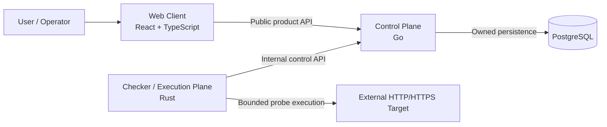

# Container View

**Architecture state:** Committed

**Implementation state:** Planned runtime topology; runtime foundations are not implemented yet.

## Purpose

This document is the C4 Level 2 view for `uptime-lab`. It defines the runtime/container responsibilities that later implementation must preserve. It describes semantic relationships, not final endpoint paths or framework-specific internals.

## Containers and Responsibilities

### Web Client — React + TypeScript

The Web Client owns browser presentation and user interaction. It consumes the public product contract exposed by the Go Control Plane. It does not own durable business state and it does not execute monitoring probes.

The browser never accesses PostgreSQL directly.

### Control Plane — Go

The Go runtime owns product/domain coordination, public and internal API semantics, monitor lifecycle behavior, scheduling decisions, durable persistence ownership, and normalization of execution results into product state.

Go exclusively owns durable product state in PostgreSQL.

The Control Plane coordinates monitoring work but does not own low-level network probe execution.

### Checker / Execution Plane — Rust

The Rust runtime owns bounded network execution. It obtains due work through the internal control boundary, executes protocol-specific probes under explicit budgets, and submits normalized results back to Go.

Rust never accesses PostgreSQL directly.

Raw transport behavior remains inside the execution boundary; product/domain interpretation belongs to the Control Plane.

### PostgreSQL

PostgreSQL is the durable application store owned exclusively through the Go Control Plane. Future schemas may align with Go business-module ownership, beginning with the Monitoring capability.

No browser or checker code may use PostgreSQL as an integration shortcut.

### External HTTP/HTTPS Target

The monitored target is external and untrusted. The checker reaches it through bounded outbound execution rather than exposing target behavior directly to the rest of the system.

### Docker Compose

Docker Compose is committed as the future canonical local orchestration topology. It is infrastructure, not a domain/runtime owner, and its implementation belongs to a later foundation phase.

## Container Diagram

## Relationship Semantics

The relationship labels are architectural contracts:

| Relationship | Meaning |
|---|---|
| Web -> Go: Public product API | User-facing configuration and query semantics are owned by Go and consumed by the browser. |
| Rust -> Go: Internal control API | Work assignment and normalized result submission cross the process boundary through a controlled internal contract. |
| Go -> PostgreSQL: Owned persistence | Durable product state is written and read only through Go-owned persistence boundaries. |
| Rust -> Target: Bounded probe execution | External network execution is isolated in Rust and must obey security/resource budgets. |

The initial transport is expected to be HTTP, but endpoint paths and schema shapes are deferred to the contract foundation.

## Ownership Rules

Cross-runtime communication is contract-driven.

The following ownership rules are normative:

- Web owns presentation and interaction, not product persistence.
- Go owns business/domain coordination and durable product state.
- Rust owns bounded network execution, not product persistence.
- PostgreSQL is not a cross-runtime integration bus.
- External targets are never trusted as internal system components.

## Planned Local Orchestration

The future local development topology will run the Web Client, Go Control Plane, Rust Checker, and PostgreSQL under Docker Compose. This architecture document commits the relationship, not the compose file, image strategy, health checks, or development lifecycle implementation.

## Security Boundaries

There are three important trust transitions:

1. browser input entering the public Control Plane boundary;
2. internal work/result data crossing between Go and Rust;
3. untrusted target/DNS/network behavior entering the Rust execution boundary.

The third boundary is especially security-sensitive because it carries SSRF, redirect, DNS rebinding, private-network, cloud-metadata, timeout, response-size, and concurrency risks.

## Related Decisions

- [ADR-0001: Multi-runtime monorepo](../adr/0001-multi-runtime-monorepo.md)
- [ADR-0002: Control plane and execution plane](../adr/0002-control-plane-and-execution-plane.md)
- [ADR-0003: Contract and data ownership](../adr/0003-contract-and-data-ownership.md)
