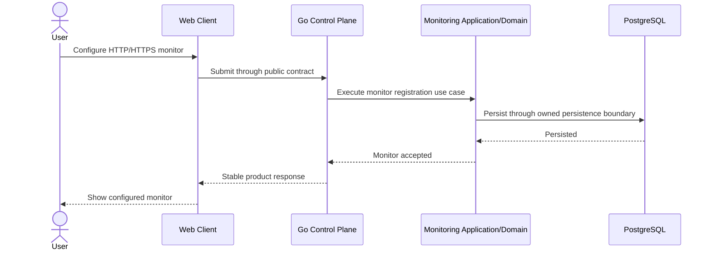
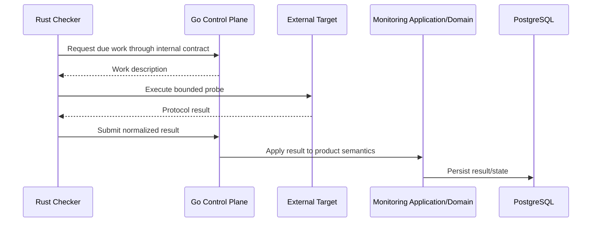
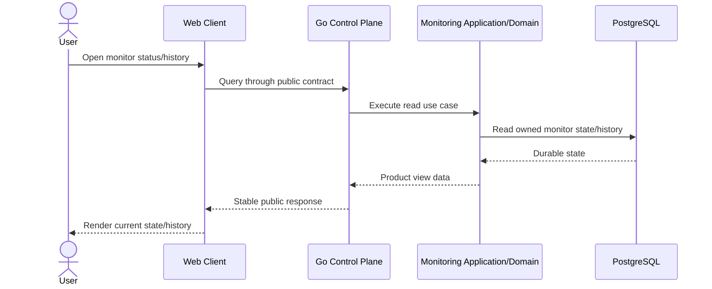
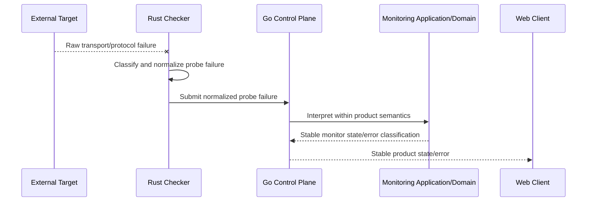

# Runtime Flows

**Architecture state:** Committed  
**Implementation state:** Conceptual cross-runtime flows; product runtimes are not implemented yet.

## Purpose

This document defines the canonical collaboration patterns between the Web Client, Go Control Plane, Rust Execution Plane, PostgreSQL, and external targets. It intentionally avoids endpoint names and transport DTOs; concrete contracts belong to the later OpenAPI foundation.

## Create Monitor

The browser never persists monitor state directly. The Go Control Plane is the durable-state owner and the Monitoring capability mediates product semantics before persistence.

## Execute Due Check

Rust owns bounded execution, not scheduling truth or product persistence. Work descriptions and normalized results cross the process boundary through the internal contract.

## Read Current State

Read ownership follows the same rule as writes: browser access remains contract-driven and PostgreSQL is never a browser-facing integration surface.

## Failure Boundary

A raw transport error is an Execution Plane implementation detail. It terminates at the Rust boundary. Only a normalized probe failure crosses into Go, where it is mapped into stable product semantics before anything becomes browser-visible or persistence-worthy.

## Correlation Context

Correlation/request context is a committed cross-runtime design intent. When observability implementation is introduced, the public request, internal work/result exchange, and persisted check result should be attributable to the same logical operation where appropriate.

No tracing backend, OpenTelemetry Collector, trace exporter, or concrete propagation header is implemented or selected by this documentation phase.

## Related Decisions

- [Container View](container-view.md)
- [Dependency Rules](dependency-rules.md)
- [Data Ownership](data-ownership.md)
- [ADR-0002 — Control Plane and Execution Plane](../adr/0002-control-plane-and-execution-plane.md)
- [ADR-0003 — Contract and Data Ownership](../adr/0003-contract-and-data-ownership.md)
