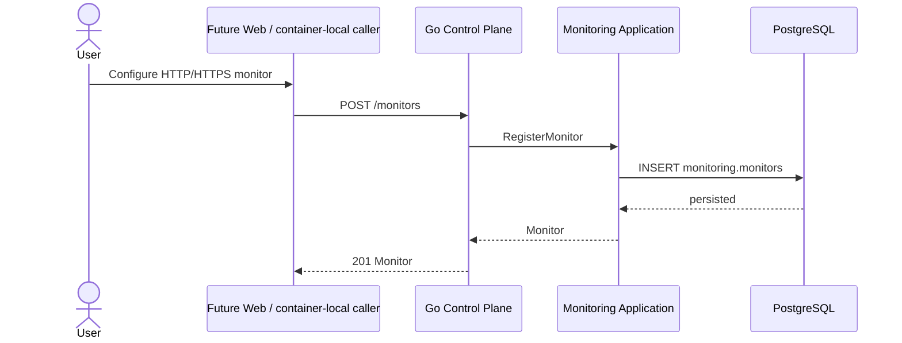
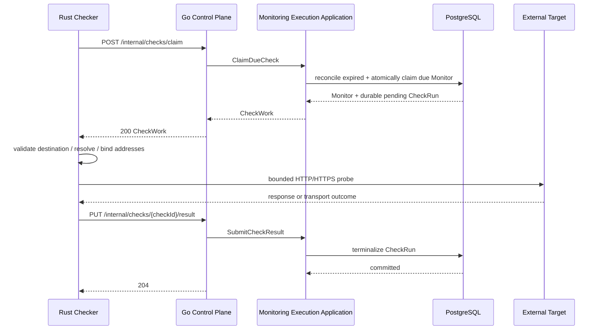
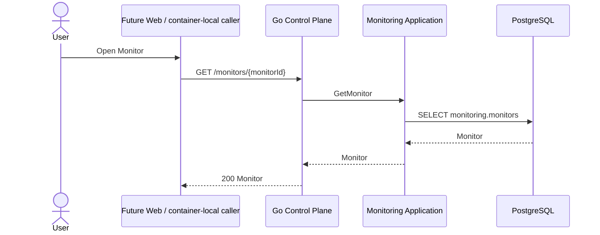
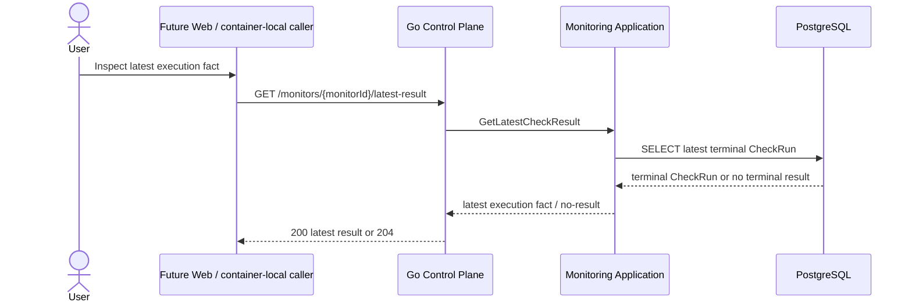
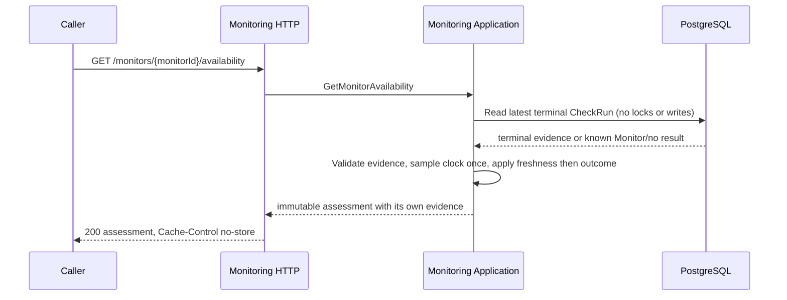
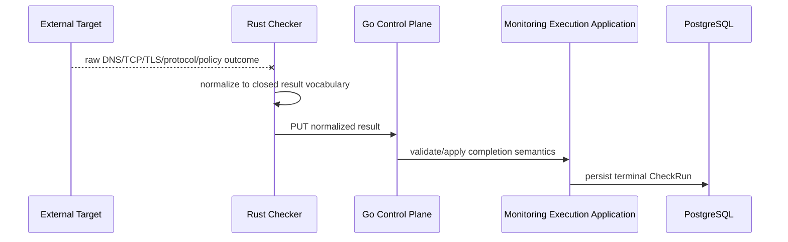

# Runtime Flows

**Architecture state:** Committed

**Implementation state:** Public Monitor create/read, latest terminal execution-result read, current availability assessment, and the internal Go/Rust execution loop are implemented. React/public network exposure, full CheckRun history, and materialized availability history remain deferred.

Current availability is exposed by `GET /monitors/{monitorId}/availability` as a read-only assessment of the latest terminal CheckRun. It returns `status`, `reason`, UTC `evaluatedAt`, and terminal `evidence` (`checkId`, `completedAt`). A known Monitor without a terminal result returns `200 unknown/no_result` with evidence omitted; the raw latest-result route retains its empty `204`. Every matched availability response, including errors and `405`, uses `Cache-Control: no-store`; `HEAD` returns `405` with `Allow: GET`. No new persistence, reconciliation, history, or public deployment is introduced.

## Purpose

This document defines the current collaboration patterns between Go, Rust, PostgreSQL, and external targets while retaining the committed Web boundary.

## Create Monitor

```mermaid
sequenceDiagram
    actor User
    participant Web as Future Web / container-local caller
    participant Go as Go Control Plane
    participant Monitoring as Monitoring Application
    participant DB as PostgreSQL

    User->>Web: Configure HTTP/HTTPS monitor
    Web->>Go: POST /monitors
    Go->>Monitoring: RegisterMonitor
    Monitoring->>DB: INSERT monitoring.monitors
    DB-->>Monitoring: persisted
    Monitoring-->>Go: Monitor
    Go-->>Web: 201 Monitor
```

`POST /monitors` is implemented. React and public host exposure are not.

## Execute Due Check

```mermaid
sequenceDiagram
    participant Rust as Rust Checker
    participant Go as Go Control Plane
    participant Monitoring as Monitoring Execution Application
    participant DB as PostgreSQL
    participant Target as External Target

    Rust->>Go: POST /internal/checks/claim
    Go->>Monitoring: ClaimDueCheck
    Monitoring->>DB: reconcile expired + atomically claim due Monitor
    DB-->>Monitoring: Monitor + durable pending CheckRun
    Monitoring-->>Go: CheckWork
    Go-->>Rust: 200 CheckWork
    Rust->>Rust: validate destination / resolve / bind addresses
    Rust->>Target: bounded HTTP/HTTPS probe
    Target-->>Rust: response or transport outcome
    Rust->>Go: PUT /internal/checks/{checkId}/result
    Go->>Monitoring: SubmitCheckResult
    Monitoring->>DB: terminalize CheckRun
    DB-->>Monitoring: committed
    Go-->>Rust: 204
```

Go owns due-work and durable identity. Rust probes a claimed CheckID once and submits only a normalized result. Rust never accesses PostgreSQL directly.

The canonical Docker smoke proves the private `http://web/` target is rejected by production destination policy as `policy_rejected`, persisted as a terminal CheckRun, and read back through the public latest-result route.

## Read Monitor

```mermaid
sequenceDiagram
    actor User
    participant Web as Future Web / container-local caller
    participant Go as Go Control Plane
    participant Monitoring as Monitoring Application
    participant DB as PostgreSQL

    User->>Web: Open Monitor
    Web->>Go: GET /monitors/{monitorId}
    Go->>Monitoring: GetMonitor
    Monitoring->>DB: SELECT monitoring.monitors
    DB-->>Monitoring: Monitor
    Monitoring-->>Go: Monitor
    Go-->>Web: 200 Monitor
```

The Monitor route returns registration state only. Execution facts remain separate from the Monitor payload.

## Read Latest Terminal Result

```mermaid
sequenceDiagram
    actor User
    participant Web as Future Web / container-local caller
    participant Go as Go Control Plane
    participant Monitoring as Monitoring Application
    participant DB as PostgreSQL

    User->>Web: Inspect latest execution fact
    Web->>Go: GET /monitors/{monitorId}/latest-result
    Go->>Monitoring: GetLatestCheckResult
    Monitoring->>DB: SELECT latest terminal CheckRun
    DB-->>Monitoring: terminal CheckRun or no terminal result
    Monitoring-->>Go: latest execution fact / no-result
    Go-->>Web: 200 latest result or 204
```

Only `completed_at IS NOT NULL` rows participate. Pending CheckRuns are invisible, including a newer pending run when an older terminal result exists. `resultKind` is an execution fact, not an up/down verdict. `worker_timeout` exposes neither `httpStatus` nor `durationMs`. Full history remains deferred.

## Current Availability Read

```mermaid
sequenceDiagram
    participant Caller
    participant Go as Monitoring HTTP
    participant App as Monitoring Application
    participant DB as PostgreSQL
    Caller->>Go: GET /monitors/{monitorId}/availability
    Go->>App: GetMonitorAvailability
    App->>DB: Read latest terminal CheckRun (no locks or writes)
    DB-->>App: terminal evidence or known Monitor/no result
    App->>App: Validate evidence, sample clock once, apply freshness then outcome
    App-->>Go: immutable assessment with its own evidence
    Go-->>Caller: 200 assessment, Cache-Control no-store
```

Future evidence and age greater than 120 seconds take precedence over outcome;
exactly 120 seconds is fresh. Unknown reasons distinguish missing, future,
stale, policy-rejected, and execution-failed evidence. The complete mapping is
documented in [Go availability policy](../backend/go-control-plane.md#availability-policy).
Pending runs remain invisible and are never reconciled by this GET. Two separate
raw-result and availability requests can legitimately read different CheckIDs.

## Failure Boundary

```mermaid
sequenceDiagram
    participant Target as External Target
    participant Rust as Rust Checker
    participant Go as Go Control Plane
    participant Monitoring as Monitoring Execution Application
    participant DB as PostgreSQL

    Target--xRust: raw DNS/TCP/TLS/protocol/policy outcome
    Rust->>Rust: normalize to closed result vocabulary
    Rust->>Go: PUT normalized result
    Go->>Monitoring: validate/apply completion semantics
    Monitoring->>DB: persist terminal CheckRun
```

Raw library errors, response bodies, headers, resolved addresses, stack traces, and credentials do not cross the internal contract.

A late result is rejected and Go owns the durable `worker_timeout` transition.

## Correlation Context

CheckID and MonitorID are stable cross-runtime correlation identifiers for the implemented execution path. No tracing backend or concrete distributed-tracing propagation contract is introduced by this milestone.

## Related Decisions

- [Container View](container-view.md)
- [Module Boundaries](module-boundaries.md)
- [Dependency Rules](dependency-rules.md)
- [Data Ownership](data-ownership.md)
- [Rust Checker](../checker/rust-checker.md)
- [ADR-0002](../adr/0002-control-plane-and-execution-plane.md)
- [ADR-0003](../adr/0003-contract-and-data-ownership.md)
