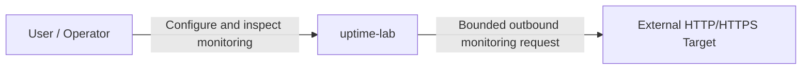

# System Context

**Architecture state:** Committed  
**Implementation state:** Foundation only; product runtimes are not implemented yet.

## Purpose

`uptime-lab` is an uptime-monitoring laboratory and reference application for designing a production-disciplined, multi-runtime system. A user/operator configures HTTP/HTTPS monitors and inspects their resulting status and history. The architecture deliberately separates product coordination from network execution so each responsibility can evolve behind an explicit boundary.

This document is the C4 Level 1 view. It treats `uptime-lab` as one system and intentionally does not expose internal runtimes, packages, crates, database schemas, or CI jobs.

## Actors and External Systems

### User / Operator

The user/operator defines monitoring intent and inspects system state. The actor does not interact with persistence or network execution mechanisms directly.

### External HTTP/HTTPS Target

A monitored target is outside the `uptime-lab` trust boundary. Its address, DNS behavior, redirects, protocol behavior, latency, response size, and availability must be treated as untrusted input from the perspective of the checker runtime.

## System Boundary

`uptime-lab` owns the product behavior required to configure monitors, coordinate checks, store durable monitoring state, execute bounded probes, and expose monitoring results to the user.

External target infrastructure, DNS infrastructure, the public internet, and the operator's monitored services remain outside the system boundary.

## Trust Boundary

User-configured outbound targets create an SSRF/egress trust boundary. A future checker implementation must validate every outbound execution against explicit network-safety constraints, including address resolution, redirect handling, request budgets, response-size limits, timeout policy, and concurrency limits.

The architectural commitment is already normative even though the runtime controls are not implemented yet.

## Context Diagram

## Responsibilities Inside uptime-lab

The system is responsible for:

- accepting monitor configuration through a product-facing boundary;
- coordinating when checks are due;
- executing monitoring requests within explicit safety budgets;
- normalizing execution results into product-level monitoring state;
- owning durable monitor and check history;
- exposing stable product state to the user;
- producing observable operational signals as those capabilities are implemented.

## Responsibilities Outside uptime-lab

The system does not own:

- the availability or correctness of monitored targets;
- public DNS infrastructure;
- external networks between the checker and a target;
- target-side authentication, redirects, TLS configuration, or server behavior;
- guarantees that an arbitrary external endpoint is safe to contact.

## Security Considerations

The foundation is not suitable for arbitrary public internet exposure. Authentication is not implemented, and the checker security controls required to safely execute user-provided network targets do not yet exist.

The architecture therefore treats public exposure, private-network monitoring, cloud metadata access, DNS rebinding, and redirect revalidation as later security gates rather than assumptions that are already satisfied.

## Related Decisions

- [ADR-0001: Multi-runtime monorepo](../adr/0001-multi-runtime-monorepo.md)
- [ADR-0002: Control plane and execution plane](../adr/0002-control-plane-and-execution-plane.md)
- [ADR-0003: Contract and data ownership](../adr/0003-contract-and-data-ownership.md)
