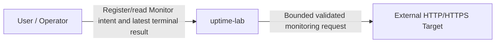

# System Context

**Architecture state:** Committed

**Implementation state:** The Go/Rust monitoring execution slice and local React browser journey are implemented. Remote public network deployment remains deferred.

## Purpose

`uptime-lab` is an uptime-monitoring laboratory and reference application for a production-disciplined multi-runtime system. A user/operator can register HTTP/HTTPS Monitor intent through the current public Go contract; Go coordinates due work and durable state; Rust executes bounded probes.

This document is the C4 Level 1 view and intentionally hides package, crate, table, and CI detail.

## Actors and External Systems

### User / Operator

The user/operator registers intent, reopens a Monitor by ID, and reads independent raw execution facts and current availability assessments. Go owns those assessments; the browser displays snapshots and refreshes only on request. Full CheckRun and availability history remain deferred.

### External HTTP/HTTPS Target

A monitored target is outside the `uptime-lab` trust boundary. Address resolution, redirects, protocol behavior, latency, response size, and availability are untrusted inputs to the Rust Checker.

## System Boundary

`uptime-lab` currently implements:

- Monitor registration/read and latest terminal execution-result read through Go;
- due-work coordination and CheckRun persistence through Go;
- bounded HTTP/HTTPS execution through Rust;
- normalized result delivery from Rust to Go;
- explicit PostgreSQL migrations and schema-aware readiness.

Remote public deployment, authentication/authorization, full CheckRun history and availability history remain outside the current implemented surface. Local browser traffic passes through Web's restricted same-origin gateway; it cannot reach internal Checker routes or PostgreSQL.

## Trust Boundary

User-configured outbound targets create an SSRF/egress trust boundary.

The production Rust Checker now enforces execution-time controls including:

- HTTP/HTTPS and default-port restrictions;
- deny-by-default non-public address policy;
- DNS answer validation and validated-address binding;
- redirect revalidation and HTTPS downgrade rejection;
- direct connections with ambient proxy settings ignored;
- TLS certificate/hostname verification;
- bounded timeout, redirects, concurrency, and response headers.

These controls make the execution boundary materially implemented; they do not make the application safe for unauthenticated public internet exposure.

## Context Diagram

```mermaid
flowchart LR
    User[User / Operator]
    System[uptime-lab]
    Target[External HTTP/HTTPS Target]

    User -->|Register/read Monitor intent and latest terminal result| System
    System -->|Bounded validated monitoring request| Target
```

## Responsibilities Inside uptime-lab

The system owns:

- public Monitor create/read and latest terminal result semantics;
- internal work/result semantics;
- due-work scheduling truth;
- durable Monitor and CheckRun state;
- bounded target execution;
- normalized execution results;
- operational health/readiness.

## Responsibilities Outside uptime-lab

The system does not own:

- monitored-target availability/correctness;
- public DNS infrastructure;
- external networks;
- target-side TLS/server behavior;
- public deployment ingress or identity policy.

## Security Considerations

The current Checker execution policy is deny-by-default for non-public destinations, but the application still has no public authentication/authorization or ingress contract. Canonical Compose publishes no application host ports.

Private-network monitoring is intentionally unsupported in production execution.

## Related Decisions

- [Container View](container-view.md)
- [Rust Checker](../checker/rust-checker.md)
- [ADR-0001: Multi-runtime monorepo](../adr/0001-multi-runtime-monorepo.md)
- [ADR-0002: Control plane and execution plane](../adr/0002-control-plane-and-execution-plane.md)
- [ADR-0003: Contract and data ownership](../adr/0003-contract-and-data-ownership.md)
