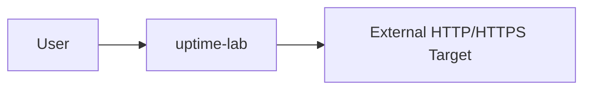
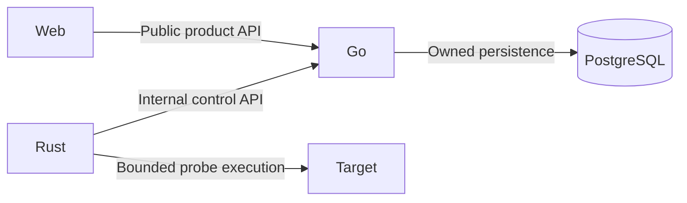
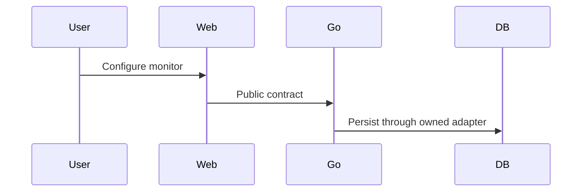
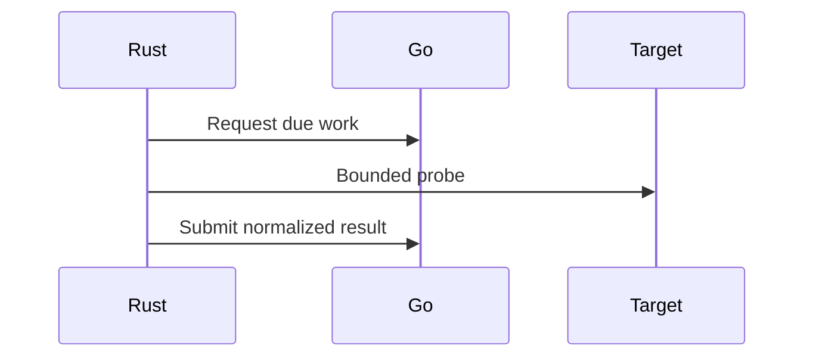
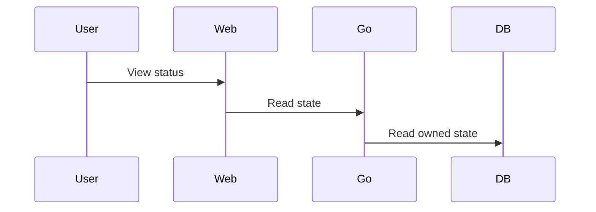
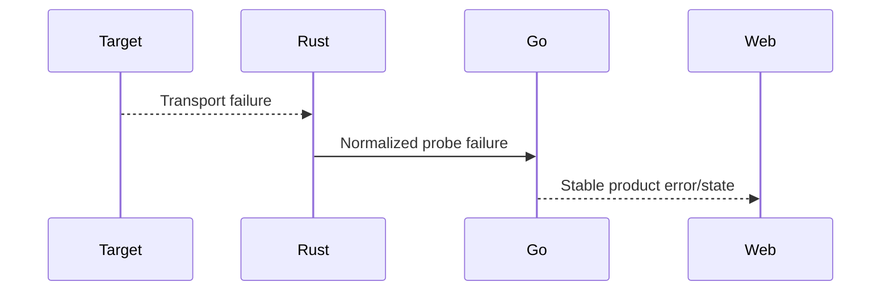
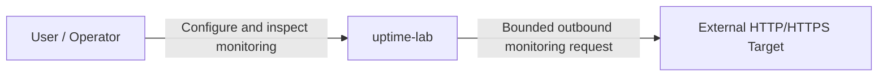
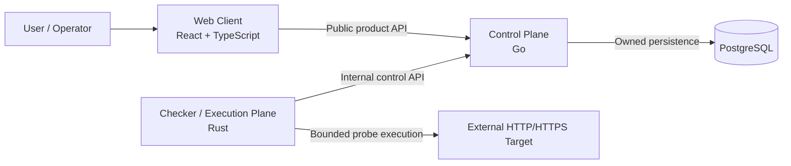
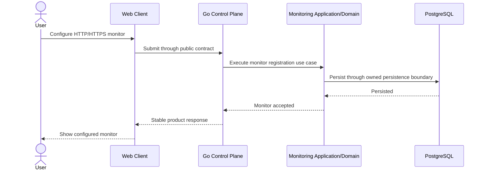
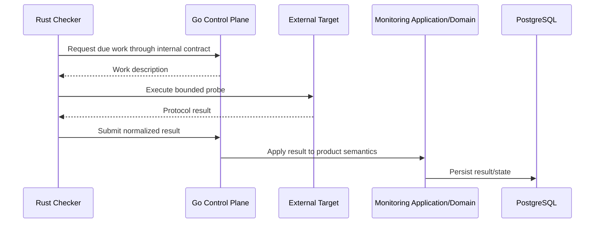

# Architecture Documentation Baseline Implementation Plan

> **For agentic workers:** REQUIRED SUB-SKILL: Use superpowers:subagent-driven-development (recommended) or superpowers:executing-plans to implement this plan task-by-task. Steps use checkbox (`- [ ]`) syntax for tracking.

**Goal:** Implement the canonical C4-first architecture documentation baseline for `uptime-lab` without introducing application runtime, Docker, API-contract, database, or product-feature implementation.

**Architecture:** The implementation proceeds from stable system-level truths toward cross-runtime flows and material ADRs. Documentation remains the source of architectural truth at system boundaries; runtime-specific implementation documentation is deferred until Go, Rust, and React foundations exist. A small dependency-free Bash validation layer verifies required files, canonical ownership statements, ADR structure, navigation links, forbidden placeholders, and documentation-only scope.

**Tech Stack:** Markdown, Mermaid, Bash, Git, GitHub Actions.

**Spec:** `docs/superpowers/specs/2026-09-17-architecture-documentation-baseline-design.md`

## Global Constraints

- Documentation is English-only for project-facing material.
- The baseline uses a C4-first canonical architecture core.
- System-level documentation owns cross-runtime architectural truth.
- Runtime-specific `frontend/**`, `backend/**`, and `checker/**` architecture documents remain deferred until corresponding runtime foundations exist.
- Architecture documents distinguish `Committed`, `Implemented`, and `Deferred` state.
- Mermaid embedded in Markdown is the baseline diagram source format.
- The Go runtime is the control plane and exclusive owner of durable product state in PostgreSQL.
- The Rust runtime is the execution/checker plane and must never access PostgreSQL directly.
- The React/TypeScript browser client must never access PostgreSQL directly.
- Cross-runtime communication is contract-driven; concrete endpoint schemas remain deferred.
- The initial Go business capability is Monitoring; hypothetical future modules must not be scaffolded.
- Message brokers, distributed worker coordination, Kubernetes, service mesh, authentication architecture, and production hosting remain outside this phase.
- No empty documentation directories or speculative component/module documents are created.
- No application source, Docker scaffold, OpenAPI contract, database migration, Go module, Cargo workspace, or frontend package is created.
- Issue #4 remains the separate repository-administration blocker. Architecture documentation work may be implemented and opened as a PR while Issue #4 is open, but the implementation PR MUST NOT merge into `main` until `main-protection` is active, the approved merge policy is independently verified, and Issue #4 is closed.
- The implementation must remain PR-first; the unprotected state of `main` is never permission for a direct push.

---

## Target File Map

```text
uptime-lab/
├── .github/
│   └── workflows/
│       └── ci.yml                                  # Add documentation validation step only.
├── docs/
│   ├── README.md                                   # Add architecture entry point.
│   ├── glossary.md                                 # Shared architecture vocabulary.
│   ├── architecture/
│   │   ├── README.md                               # Canonical reading order/index.
│   │   ├── system-context.md                       # C4 Level 1.
│   │   ├── container-view.md                       # C4 Level 2 / runtime ownership.
│   │   ├── module-boundaries.md                    # Go/Rust/frontend conceptual boundaries.
│   │   ├── dependency-rules.md                     # Allowed/forbidden dependency directions.
│   │   ├── data-ownership.md                       # Durable state and module ownership.
│   │   ├── runtime-flows.md                        # Cross-runtime sequence flows.
│   │   └── change-flow.md                          # Cross-area feature impact model.
│   └── adr/
│       ├── README.md                               # ADR policy/index.
│       ├── 0001-multi-runtime-monorepo.md
│       ├── 0002-control-plane-and-execution-plane.md
│       └── 0003-contract-and-data-ownership.md
└── scripts/
    └── ci/
        ├── check-architecture-docs.sh              # Repository documentation fitness check.
        └── test-architecture-docs.sh               # Dependency-free regression harness.
```

No `component-view.md`, `api-contracts.md`, `event-model.md`, `docs/frontend/**`, `docs/backend/**`, `docs/checker/**`, `docs/testing/**`, `docs/security/**`, or `docs/operations/**` is created in this plan.

---

### Task 1: Build architecture-documentation fitness checks with TDD

**Files:**
- Create: `scripts/ci/check-architecture-docs.sh`
- Create: `scripts/ci/test-architecture-docs.sh`

**Interfaces:**
- Consumes: the file/content contract from the approved design spec.
- Produces:
  - `check-architecture-docs.sh [root]` — validates a complete Architecture Documentation Baseline tree.
  - `test-architecture-docs.sh` — proves success and representative failure cases without touching the repository tree.

- [ ] **Step 1: Write the failing test harness first**

Create `scripts/ci/test-architecture-docs.sh` with a temporary documentation fixture. The fixture must contain all baseline paths and the minimum required headings/content so a completed checker can pass it.

Use this structure in the test:

```bash
#!/usr/bin/env bash
set -euo pipefail

SCRIPT_DIR="$(cd -- "$(dirname -- "${BASH_SOURCE[0]}")" && pwd)"
CHECKER="$SCRIPT_DIR/check-architecture-docs.sh"
TMP="$(mktemp -d)"
trap 'rm -rf "$TMP"' EXIT

PASS=0
FAIL=0

pass() { printf 'PASS: %s\n' "$1"; PASS=$((PASS + 1)); }
fail() { printf 'FAIL: %s\n' "$1" >&2; FAIL=$((FAIL + 1)); }
expect_success() { local n="$1"; shift; if "$@" >/dev/null 2>&1; then pass "$n"; else fail "$n"; fi; }
expect_failure() { local n="$1"; shift; if "$@" >/dev/null 2>&1; then fail "$n"; else pass "$n"; fi; }

make_fixture() {
  rm -rf "$TMP/repo"
  mkdir -p "$TMP/repo/docs/architecture" "$TMP/repo/docs/adr"

  cat > "$TMP/repo/docs/README.md" <<'EOF'
# Documentation

See [Architecture](architecture/README.md).
EOF

  cat > "$TMP/repo/docs/glossary.md" <<'EOF'
# Architecture Glossary

## Control Plane
Go runtime owning product/domain coordination and durable product state.

## Execution Plane
Rust runtime owning bounded probe execution.

## Canonical Documentation
Repository-owned authoritative architecture documentation.
EOF

  cat > "$TMP/repo/docs/architecture/README.md" <<'EOF'
# Architecture

## Reading Order
- [System Context](system-context.md)
- [Container View](container-view.md)
- [Module Boundaries](module-boundaries.md)
- [Dependency Rules](dependency-rules.md)
- [Data Ownership](data-ownership.md)
- [Runtime Flows](runtime-flows.md)
- [Change Flow](change-flow.md)
- [Architecture Decision Records](../adr/README.md)
EOF

  cat > "$TMP/repo/docs/architecture/system-context.md" <<'EOF'
# System Context

**Architecture state:** Committed


EOF

  cat > "$TMP/repo/docs/architecture/container-view.md" <<'EOF'
# Container View

**Architecture state:** Committed

Go is the **Control Plane**. Rust is the **Execution Plane**. React/TypeScript is the Web Client. Go exclusively owns durable product state in PostgreSQL. Rust never accesses PostgreSQL directly. The browser never accesses PostgreSQL directly.


EOF

  cat > "$TMP/repo/docs/architecture/module-boundaries.md" <<'EOF'
# Module Boundaries

**Architecture state:** Committed

Monitoring is the initial Go business capability. The checker uses Ports and Adapters. Frontend dependency direction is app -> pages -> widgets -> features -> entities -> shared.
EOF

  cat > "$TMP/repo/docs/architecture/dependency-rules.md" <<'EOF'
# Dependency Rules

Browser -> PostgreSQL is forbidden.
Rust Checker -> PostgreSQL is forbidden.
Cross-runtime implementation-code sharing is forbidden.
EOF

  cat > "$TMP/repo/docs/architecture/data-ownership.md" <<'EOF'
# Data Ownership

Go exclusively owns durable product state in PostgreSQL. Cross-module SQL reads are forbidden. Service extraction is not a current goal.
EOF

  cat > "$TMP/repo/docs/architecture/runtime-flows.md" <<'EOF'
# Runtime Flows

## Create Monitor


## Execute Due Check


## Read Current State


## Failure Boundary

EOF

  cat > "$TMP/repo/docs/architecture/change-flow.md" <<'EOF'
# Change Flow

## Canonical Example: Configure HTTP Request Timeout
Product intent -> Go domain/application -> persistence -> public/internal contracts -> frontend -> Rust execution policy -> tests -> security -> observability -> CI/documentation.
EOF

  cat > "$TMP/repo/docs/adr/README.md" <<'EOF'
# Architecture Decision Records

- [ADR-0001](0001-multi-runtime-monorepo.md)
- [ADR-0002](0002-control-plane-and-execution-plane.md)
- [ADR-0003](0003-contract-and-data-ownership.md)
EOF

  for adr in \
    0001-multi-runtime-monorepo.md \
    0002-control-plane-and-execution-plane.md \
    0003-contract-and-data-ownership.md; do
    cat > "$TMP/repo/docs/adr/$adr" <<'EOF'
# Decision

## Status
Accepted

## Context
Context.

## Decision
Decision.

## Alternatives Considered
Alternatives.

## Consequences
Consequences.

## Related Documentation
Related docs.
EOF
  done
}

make_fixture
expect_failure "checker does not exist before implementation" "$CHECKER" "$TMP/repo"

printf '\nArchitecture documentation tests: %d passed, %d failed\n' "$PASS" "$FAIL"
test "$FAIL" -eq 0
```

Make the harness executable.

- [ ] **Step 2: Verify RED**

Run:

```bash
chmod +x scripts/ci/test-architecture-docs.sh
./scripts/ci/test-architecture-docs.sh
```

Expected: non-zero exit because `check-architecture-docs.sh` does not exist.

- [ ] **Step 3: Implement `check-architecture-docs.sh`**

The checker must:

1. require the exact 13 baseline documentation files;
2. reject forbidden placeholder tokens in canonical docs;
3. require the architecture index to link every baseline architecture document and ADR index;
4. require `docs/README.md` to link `architecture/README.md`;
5. require every ADR to contain `Status`, `Context`, `Decision`, `Alternatives Considered`, `Consequences`, and `Related Documentation` headings;
6. require all three baseline ADRs to contain `Accepted` status;
7. require canonical ownership phrases in container/data/dependency documents;
8. require four `sequenceDiagram` blocks in `runtime-flows.md`;
9. require the timeout example in `change-flow.md`;
10. reject forbidden speculative documentation paths if they exist during this phase.

Implement with Bash only; do not add a Markdown site generator or new package ecosystem.

The required path array is:

```bash
REQUIRED_FILES=(
  docs/README.md
  docs/glossary.md
  docs/architecture/README.md
  docs/architecture/system-context.md
  docs/architecture/container-view.md
  docs/architecture/module-boundaries.md
  docs/architecture/dependency-rules.md
  docs/architecture/data-ownership.md
  docs/architecture/runtime-flows.md
  docs/architecture/change-flow.md
  docs/adr/README.md
  docs/adr/0001-multi-runtime-monorepo.md
  docs/adr/0002-control-plane-and-execution-plane.md
  docs/adr/0003-contract-and-data-ownership.md
)
```

Note: this list contains 14 files because `docs/README.md` is modified rather than newly created. The checker validates the complete canonical surface, not only newly created files.

Use fixed-string `grep -Fq` checks for canonical phrases and navigation links so shell quoting remains deterministic.

- [ ] **Step 4: Extend the test harness to prove representative failures**

After the checker exists, replace the single RED assertion with these cases:

```text
1. complete fixture passes;
2. missing runtime-flows.md fails;
3. placeholder token injected into a canonical architecture file fails;
4. missing ADR Consequences heading fails;
5. missing architecture navigation link fails;
6. direct Rust-to-PostgreSQL ownership wording removed from dependency rules fails;
7. only three sequenceDiagram blocks in runtime-flows.md fails;
8. speculative docs/backend directory fails.
```

Every case must recreate the fixture before mutation so tests are isolated.

- [ ] **Step 5: Verify GREEN**

Run:

```bash
chmod +x scripts/ci/check-architecture-docs.sh scripts/ci/test-architecture-docs.sh
./scripts/ci/test-architecture-docs.sh
bash -n scripts/ci/check-architecture-docs.sh scripts/ci/test-architecture-docs.sh
```

Expected final line:

```text
Architecture documentation tests: 8 passed, 0 failed
```

- [ ] **Step 6: Commit Task 1**

```bash
git add scripts/ci/check-architecture-docs.sh scripts/ci/test-architecture-docs.sh
git commit -m "test(docs): add architecture documentation fitness checks"
```

---

### Task 2: Document system context and runtime/container ownership

**Files:**
- Create: `docs/architecture/system-context.md`
- Create: `docs/architecture/container-view.md`

**Interfaces:**
- Consumes: ADB-001 through ADB-006 plus foundation runtime ownership.
- Produces: canonical C4 Level 1 and Level 2 views used by every later architecture document.

- [ ] **Step 1: Create `system-context.md`**

Use this section structure:

```markdown
# System Context

**Architecture state:** Committed
**Implementation state:** Foundation only; product runtimes are not implemented yet.

## Purpose
## Actors and External Systems
## System Boundary
## Trust Boundary
## Context Diagram
## Responsibilities Inside uptime-lab
## Responsibilities Outside uptime-lab
## Security Considerations
## Related Decisions
```

The Mermaid diagram must stay technology-light:



Required prose:

- `uptime-lab` is one product/system boundary;
- the user/operator configures monitors and observes status/history;
- monitored targets are external and untrusted;
- outbound target execution creates an SSRF/egress trust boundary;
- arbitrary public internet exposure is not considered safe until later checker security controls are implemented;
- Go/Rust/React/PostgreSQL details are intentionally absent from Level 1.

- [ ] **Step 2: Create `container-view.md`**

Use this section structure:

```markdown
# Container View

**Architecture state:** Committed
**Implementation state:** Planned runtime topology; runtime foundations are not implemented yet.

## Purpose
## Containers and Responsibilities
## Container Diagram
## Relationship Semantics
## Ownership Rules
## Planned Local Orchestration
## Security Boundaries
## Related Decisions
```

The Mermaid diagram must contain exactly these semantic relationships:



Required ownership statements, using the same wording later checked mechanically:

```text
Go is the Control Plane.
Rust is the Execution Plane.
React/TypeScript is the Web Client.
Go exclusively owns durable product state in PostgreSQL.
Rust never accesses PostgreSQL directly.
The browser never accesses PostgreSQL directly.
Cross-runtime communication is contract-driven.
```

Docker Compose may be described only as the committed future local orchestration topology. Do not present it as implemented.

- [ ] **Step 3: Verify Task 2**

Run:

```bash
grep -Fq '**Architecture state:** Committed' docs/architecture/system-context.md
grep -Fq 'flowchart LR' docs/architecture/system-context.md
grep -Fq 'Go exclusively owns durable product state in PostgreSQL.' docs/architecture/container-view.md
grep -Fq 'Rust never accesses PostgreSQL directly.' docs/architecture/container-view.md
grep -Fq 'Cross-runtime communication is contract-driven.' docs/architecture/container-view.md
git diff --check
```

Expected: all commands exit `0`.

- [ ] **Step 4: Commit Task 2**

```bash
git add docs/architecture/system-context.md docs/architecture/container-view.md
git commit -m "docs(architecture): define system and container views"
```

---

### Task 3: Document module boundaries, dependency direction, and data ownership

**Files:**
- Create: `docs/architecture/module-boundaries.md`
- Create: `docs/architecture/dependency-rules.md`
- Create: `docs/architecture/data-ownership.md`

**Interfaces:**
- Consumes: Task 2 runtime ownership.
- Produces: normative module/dependency/data rules later translated into runtime architecture fitness functions.

- [ ] **Step 1: Create `module-boundaries.md`**

Required sections:

```markdown
# Module Boundaries

**Architecture state:** Committed

## Purpose
## Go Control Plane
### Monitoring
### Future Business Modules
## Rust Checker
## Frontend
## Cross-Boundary Rules
## Extension Without Premature Distribution
## Related Decisions
```

Required content:

- Monitoring is the initial Go business capability;
- future examples such as Incidents or Notifications are examples only, not folders to create;
- each Go business module owns domain model, application use cases, ports, persistence boundary, domain events, and exposed application boundary;
- direct cross-module persistence reads are forbidden;
- no global shared business model or generic cross-domain repository;
- Rust uses checker core, protocol probe adapters, control-plane client adapter, and composition root conceptually;
- frontend dependency direction is `app -> pages -> widgets -> features -> entities -> shared`;
- service extraction is possible later only when measurable requirements justify it, not a current goal.

- [ ] **Step 2: Create `dependency-rules.md`**

Include the allow/deny matrix from the design spec and a dedicated **Forbidden Edges** section containing these exact lines:

```text
Browser -> PostgreSQL is forbidden.
Browser -> Checker internal interface is forbidden.
Rust Checker -> PostgreSQL is forbidden.
Go Domain -> infrastructure adapters is forbidden.
Go module A -> Go module B persistence adapter is forbidden.
Cross-runtime implementation-code sharing is forbidden.
```

Add a **Future Enforcement** section explaining that Go import rules, frontend lint boundaries, and Rust crate dependency checks will be implemented only when those runtimes exist.

- [ ] **Step 3: Create `data-ownership.md`**

Required sections:

```markdown
# Data Ownership

**Architecture state:** Committed

## Primary Ownership Rule
## Runtime Access
## Go Module Ownership
## Cross-Module Integration
## Initial Monitoring Namespace
## Extraction Consequence
## Non-goals
## Related Decisions
```

Required exact statement:

```text
Go exclusively owns durable product state in PostgreSQL.
```

Also state:

- browser state changes happen only through the public contract;
- Rust results enter through the internal contract;
- initial intended PostgreSQL namespace is `monitoring.*` but tables/columns are deferred;
- cross-module SQL reads are forbidden;
- module interaction uses application interfaces or domain/integration events when justified;
- service extraction is not a current goal.

- [ ] **Step 4: Verify Task 3**

```bash
grep -Fq 'Monitoring is the initial Go business capability' docs/architecture/module-boundaries.md
grep -Fq 'Rust Checker -> PostgreSQL is forbidden.' docs/architecture/dependency-rules.md
grep -Fq 'Cross-runtime implementation-code sharing is forbidden.' docs/architecture/dependency-rules.md
grep -Fq 'Go exclusively owns durable product state in PostgreSQL.' docs/architecture/data-ownership.md
grep -Fq 'service extraction is not a current goal' docs/architecture/data-ownership.md
git diff --check
```

Expected: all commands exit `0`.

- [ ] **Step 5: Commit Task 3**

```bash
git add docs/architecture/module-boundaries.md docs/architecture/dependency-rules.md docs/architecture/data-ownership.md
git commit -m "docs(architecture): define boundaries and data ownership"
```

---

### Task 4: Document runtime flows and cross-area change flow

**Files:**
- Create: `docs/architecture/runtime-flows.md`
- Create: `docs/architecture/change-flow.md`

**Interfaces:**
- Consumes: Tasks 2–3 ownership and dependency rules.
- Produces: canonical cross-runtime behavior and the reusable architecture-impact model for future changes.

- [ ] **Step 1: Create `runtime-flows.md` with four sequence diagrams**

Use sections:

```markdown
# Runtime Flows

**Architecture state:** Committed
**Implementation state:** Conceptual flows; endpoint names and transport details remain deferred.

## Purpose
## Create Monitor
## Execute Due Check
## Read Current State
## Failure Boundary
## Correlation Context
## What These Flows Do Not Define
## Related Decisions
```

The four Mermaid diagrams must express:

**Create Monitor**



**Execute Due Check**



**Read Current State** and **Failure Boundary** must follow the same responsibilities from the design spec. Failure Boundary must explicitly show raw transport failure terminating in Rust and only a normalized probe failure crossing into Go.

- [ ] **Step 2: Create `change-flow.md`**

Use the canonical example `Configure HTTP Request Timeout` and these sections:

```markdown
# Change Flow

## Purpose
## Canonical Example: Configure HTTP Request Timeout
### 1. Product Intent
### 2. Domain/Application Impact
### 3. Persistence Impact
### 4. Contract Impact
### 5. Frontend Impact
### 6. Checker Impact
### 7. Testing Impact
### 8. Security Impact
### 9. Observability Impact
### 10. CI and Documentation Impact
## Reusable Change-Impact Checklist
## Anti-patterns
## Related Decisions
```

The example must stay conceptual and state explicitly that request-timeout configuration is not implemented by this documentation phase.

The reusable checklist must ask whether a change affects:

```text
product behavior
Go domain/application policy
persistence semantics
public contract
internal contract
frontend presentation/input
Rust execution policy
security budgets/trust boundaries
test evidence
observability signals
CI paths
canonical architecture documentation
ADR requirements
```

- [ ] **Step 3: Verify Task 4**

```bash
test "$(grep -c '^sequenceDiagram$' docs/architecture/runtime-flows.md)" -eq 4
grep -Fq 'normalized probe failure' docs/architecture/runtime-flows.md
grep -Fq 'Configure HTTP Request Timeout' docs/architecture/change-flow.md
grep -Fq 'not implemented by this documentation phase' docs/architecture/change-flow.md
git diff --check
```

Expected: all commands exit `0`.

- [ ] **Step 4: Commit Task 4**

```bash
git add docs/architecture/runtime-flows.md docs/architecture/change-flow.md
git commit -m "docs(architecture): document runtime and change flows"
```

---

### Task 5: Establish shared vocabulary and the minimal ADR baseline

**Files:**
- Create: `docs/glossary.md`
- Create: `docs/adr/README.md`
- Create: `docs/adr/0001-multi-runtime-monorepo.md`
- Create: `docs/adr/0002-control-plane-and-execution-plane.md`
- Create: `docs/adr/0003-contract-and-data-ownership.md`

**Interfaces:**
- Consumes: Tasks 2–4 architecture truths.
- Produces: canonical terminology and rationale for the three expensive-to-reverse cross-boundary decisions.

- [ ] **Step 1: Create `docs/glossary.md`**

Define exactly the architecture terms required by the spec:

```text
Control Plane
Execution Plane
Web Client
Monitor
Probe
Check Result
Module
Port
Adapter
Domain Event
Integration Event
Public Contract
Internal Contract
Architecture Fitness Function
Canonical Documentation
```

Definitions must align with the system docs. Do not add deferred vendor/tool definitions.

- [ ] **Step 2: Create `docs/adr/README.md`**

Required ADR lifecycle:

```text
Proposed
Accepted
Superseded
Rejected
```

Required filename pattern:

```text
NNNN-kebab-case-title.md
```

Required sections for every ADR:

```text
Status
Context
Decision
Alternatives Considered
Consequences
Related Documentation
```

The index must link ADR-0001, ADR-0002, and ADR-0003.

- [ ] **Step 3: Create ADR-0001 — Multi-runtime monorepo**

Record:

- Status: Accepted;
- one repository;
- React/TypeScript web client;
- Go control plane;
- Rust checker;
- one product/release boundary initially;
- alternatives: separate repos, one-language system, premature microservice split;
- consequences: atomic cross-runtime review/contract changes versus heterogeneous toolchain complexity.

- [ ] **Step 4: Create ADR-0002 — Control plane and execution plane**

Record:

- Status: Accepted;
- Go owns product/domain coordination;
- Rust owns bounded network execution;
- Go does not embed low-level checker implementation;
- Rust does not own primary durable product persistence;
- alternatives: Go probes everything, Rust owns persistence too, checker embedded in Go;
- consequence: process-boundary contract cost in exchange for clearer ownership and execution isolation.

- [ ] **Step 5: Create ADR-0003 — Contract and data ownership**

Record:

- Status: Accepted;
- runtime communication is contract-driven;
- public and internal contracts are separate concepts;
- Go exclusively owns PostgreSQL durable product state;
- Rust returns normalized results through the internal boundary;
- browser communicates only through the public boundary;
- alternatives: shared DB integration, cross-language shared implementation models, frontend-to-storage coupling;
- consequence: explicit mapping/contract work in exchange for reduced hidden coupling and a cleaner future extraction path.

- [ ] **Step 6: Verify Task 5**

```bash
for adr in docs/adr/000{1,2,3}-*.md; do
  grep -Fq '## Status' "$adr"
  grep -Fq 'Accepted' "$adr"
  grep -Fq '## Context' "$adr"
  grep -Fq '## Decision' "$adr"
  grep -Fq '## Alternatives Considered' "$adr"
  grep -Fq '## Consequences' "$adr"
  grep -Fq '## Related Documentation' "$adr"
done
grep -Fq '## Control Plane' docs/glossary.md
grep -Fq '## Execution Plane' docs/glossary.md
git diff --check
```

Expected: all commands exit `0`.

- [ ] **Step 7: Commit Task 5**

```bash
git add docs/glossary.md docs/adr
git commit -m "docs(architecture): establish glossary and ADR baseline"
```

---

### Task 6: Add canonical navigation and run the complete documentation fitness check

**Files:**
- Create: `docs/architecture/README.md`
- Modify: `docs/README.md`

**Interfaces:**
- Consumes: Tasks 2–5 completed documentation tree and Task 1 checker.
- Produces: one canonical reading path from repository documentation index through architecture and ADRs.

- [ ] **Step 1: Create `docs/architecture/README.md`**

Use this order:

```markdown
# Architecture

## Purpose
## Architecture State Semantics
## Canonical Reading Order
## System Views
## Boundaries and Ownership
## Runtime and Change Flows
## Architecture Decision Records
## Documentation Ownership
## Architecture Change Policy
```

The canonical reading order must link:

```text
system-context.md
container-view.md
module-boundaries.md
dependency-rules.md
data-ownership.md
runtime-flows.md
change-flow.md
../adr/README.md
```

State semantics must define:

- Committed — approved normative architecture;
- Implemented — corresponding repository/runtime behavior exists with evidence;
- Deferred — intentionally delayed until a named requirement becomes real.

- [ ] **Step 2: Modify `docs/README.md`**

Add an explicit architecture entry:

```markdown
## Architecture

Start with the [Architecture index](architecture/README.md) for the canonical system context, runtime boundaries, dependency rules, data ownership, flows, and ADRs.
```

Preserve the existing area-ownership explanation and the rule that empty documentation trees are not pre-created.

- [ ] **Step 3: Run the full checker against the real repository**

```bash
./scripts/ci/test-architecture-docs.sh
./scripts/ci/check-architecture-docs.sh .
git diff --check
```

Expected:

```text
Architecture documentation tests: 8 passed, 0 failed
```

and `check-architecture-docs.sh .` exits `0`.

- [ ] **Step 4: Verify the scope remains documentation-only**

From the implementation branch relative to its base:

```bash
git diff --name-only <implementation-base>...HEAD
```

Every changed path must be under one of:

```text
docs/
scripts/ci/
.github/workflows/ci.yml
```

The diff must contain none of:

```text
apps/
contracts/
deploy/
compose.yaml
Dockerfile
package.json
go.mod
Cargo.toml
```

- [ ] **Step 5: Commit Task 6**

```bash
git add docs/README.md docs/architecture/README.md
git commit -m "docs(architecture): add canonical architecture navigation"
```

---

### Task 7: Integrate architecture documentation verification into CI

**Files:**
- Modify: `.github/workflows/ci.yml`

**Interfaces:**
- Consumes: Task 1 validation scripts and complete documentation tree.
- Produces: architecture-documentation regression protection inside the existing stable `CI / repository` job; the required aggregate check remains `CI / gate`.

- [ ] **Step 1: Add one repository-job step after governance bootstrap tests**

Add:

```yaml
      - name: Run architecture documentation tests
        run: |
          ./scripts/ci/test-architecture-docs.sh
          ./scripts/ci/check-architecture-docs.sh .
```

Do not create another required top-level job. The stable branch-protection surface remains `CI / gate`.

- [ ] **Step 2: Keep CI security invariants unchanged**

Verify:

```bash
grep -Fq 'permissions:' .github/workflows/ci.yml
grep -Fq 'contents: read' .github/workflows/ci.yml
grep -Fq 'persist-credentials: false' .github/workflows/ci.yml
grep -Fq 'Run architecture documentation tests' .github/workflows/ci.yml
```

Do not add write permission, secrets, `pull_request_target`, or a documentation package manager.

- [ ] **Step 3: Run all local repository governance checks**

```bash
./scripts/ci/test-governance.sh
./scripts/github/test-configure-governance.sh
./scripts/ci/test-architecture-docs.sh
./scripts/ci/check-repository-shape.sh .
./scripts/ci/check-architecture-docs.sh .
git diff --check
```

Expected: all exit `0`.

- [ ] **Step 4: Commit Task 7**

```bash
git add .github/workflows/ci.yml
git commit -m "ci(docs): enforce architecture documentation baseline"
```

---

### Task 8: Open the implementation PR and hold the merge gate on Issue #4

**Files:**
- No new source files.
- Review all files from Tasks 1–7.

**Interfaces:**
- Consumes: complete Architecture Documentation Baseline implementation branch.
- Produces: one reviewable documentation PR with CI evidence; merge remains blocked until repository administration is fixed.

- [ ] **Step 1: Run final branch verification**

```bash
./scripts/ci/test-governance.sh
./scripts/github/test-configure-governance.sh
./scripts/ci/test-architecture-docs.sh
./scripts/ci/check-repository-shape.sh .
./scripts/ci/check-architecture-docs.sh .
./scripts/ci/check-pr-title.sh "docs(architecture): establish architecture documentation baseline"
git diff --check <implementation-base>...HEAD
git log --format='%s' <implementation-base>..HEAD
```

Expected:

- governance tests pass;
- GitHub governance bootstrap tests pass;
- architecture documentation tests report `8 passed, 0 failed`;
- repository-shape and architecture-doc checks pass;
- PR title passes;
- every branch commit subject follows Conventional Commits.

- [ ] **Step 2: Open a PR with this title**

```text
docs(architecture): establish architecture documentation baseline
```

The PR body must explicitly state:

```text
Architecture impact: Establishes canonical system-level architecture documentation only.
Contract impact: No concrete API schema or endpoint is introduced.
Database impact: Documents ownership only; no migration or table schema is introduced.
Security impact: Documents the outbound SSRF/egress trust boundary and ownership rules; no runtime control is claimed as implemented.
Testing evidence: Documentation fitness harness, repository governance checks, and CI / gate.
Documentation: Adds C4-first architecture core, glossary, runtime/change flows, and ADR baseline.
Breaking changes: None; documentation only.
Governance blocker: Issue #4 remains open; this PR must not merge until main-protection and merge policy are verified and Issue #4 is closed.
```

- [ ] **Step 3: Require GitHub Actions evidence**

Required jobs:

```text
CI / policy      success
CI / repository  success
CI / gate        success
```

`CI / repository` must visibly include the `Run architecture documentation tests` step.

- [ ] **Step 4: Verify Issue #4 before any merge attempt**

Use the GitHub API or repository tooling to confirm all of the following before marking the implementation PR mergeable by policy:

```text
allow_squash_merge       true
allow_merge_commit       false
allow_rebase_merge       false
delete_branch_on_merge   true
main-protection ruleset  active
required check           CI / gate
strict/up-to-date        true
linear history           required
force pushes             blocked
branch deletion          blocked
Issue #4                 closed
```

If any item is false or missing, leave the implementation PR open/draft and stop. Do not bypass the gate.

- [ ] **Step 5: When governance is verified, squash-merge only**

Squash commit subject:

```text
docs(architecture): establish architecture documentation baseline
```

After merge, rerun/observe `main` CI and verify `CI / gate` success before declaring the documentation baseline complete.

---

## Implementer Self-Review

Before completion, verify:

- [ ] Only the approved canonical documentation files, narrow Bash validation scripts, and the existing CI workflow changed.
- [ ] `component-view.md`, `api-contracts.md`, `event-model.md`, and runtime-specific documentation trees were not created.
- [ ] All project-facing documentation is English.
- [ ] System-level documents distinguish Committed / Implemented / Deferred state.
- [ ] Go is consistently described as the Control Plane.
- [ ] Rust is consistently described as the Execution Plane.
- [ ] React/TypeScript is consistently described as the Web Client.
- [ ] Go exclusively owns durable product state in PostgreSQL.
- [ ] Direct Rust-to-PostgreSQL and browser-to-PostgreSQL access are explicitly forbidden.
- [ ] Cross-runtime communication is contract-driven without endpoint schemas being invented.
- [ ] Monitoring is identified as the initial Go business capability without speculative module scaffolding.
- [ ] Exactly four canonical runtime sequence diagrams exist.
- [ ] The HTTP request-timeout change example crosses product, Go, persistence, contracts, frontend, Rust, tests, security, observability, CI, and documentation.
- [ ] ADR-0001, ADR-0002, and ADR-0003 are Accepted and include alternatives plus consequences.
- [ ] Architecture navigation reaches every canonical document and ADR index.
- [ ] No forbidden placeholder token remains in canonical architecture docs.
- [ ] No docs site generator, package ecosystem, or Mermaid CLI was introduced for the baseline.
- [ ] Issue #4 is treated as a hard merge gate, not silently ignored.

## Exit Criteria

This plan is complete only when:

1. all baseline architecture documents and three ADRs exist with the approved content boundaries;
2. architecture documentation tests pass with `8 passed, 0 failed`;
3. the complete repository passes architecture-doc, governance, repository-shape, and whitespace checks;
4. CI executes architecture documentation validation inside `CI / repository` and aggregate `CI / gate` succeeds;
5. the implementation PR contains no runtime, Docker, API-contract, database, or product-feature implementation;
6. repository governance is independently verified and Issue #4 is closed before merge;
7. the architecture documentation PR is squash-merged and the merged `main` revision has a successful `CI / gate`.

The next project gate after this plan is implemented and merged is **Docker-first Local Development Environment design/planning**. It must not begin automatically as part of this documentation implementation.
