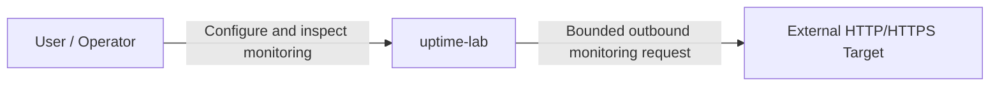
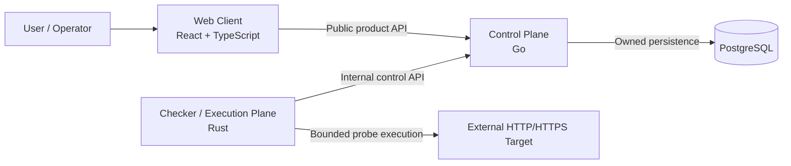
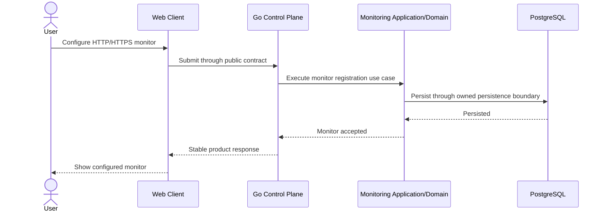
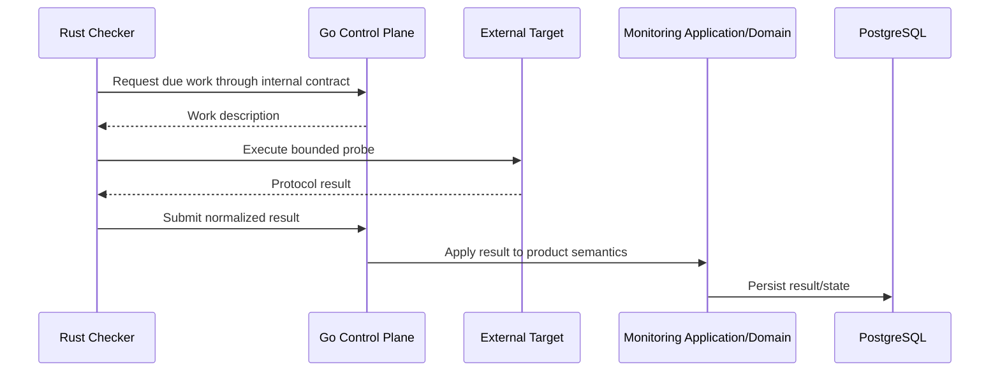

# Architecture Documentation Baseline Implementation Plan

> **For agentic workers:** REQUIRED SUB-SKILL: Use superpowers:subagent-driven-development (recommended) or superpowers:executing-plans to implement this plan task-by-task. Steps use checkbox (`- [ ]`) syntax for tracking.

**Goal:** Implement the canonical C4-first architecture documentation baseline for `uptime-lab` without introducing runtime, Docker, API-contract, database, or product-feature implementation.

**Architecture:** The work proceeds from stable system-level truths to runtime relationships, ownership rules, cross-area flows, and three material ADRs. A dependency-free Bash fitness check validates the canonical documentation surface and is integrated into the existing `CI / repository` job so the externally required check remains the stable `CI / gate`.

**Tech Stack:** Markdown, Mermaid, Bash, Git, GitHub Actions.

**Spec:** `docs/superpowers/specs/2026-09-17-architecture-documentation-baseline-design.md`

## Global Constraints

- Project-facing documentation is English.
- The documentation model is C4-first and system-level documentation owns cross-runtime truth.
- Architecture documents distinguish `Committed`, `Implemented`, and `Deferred` state.
- Mermaid embedded in Markdown is the baseline diagram source format.
- Go is the Control Plane and exclusively owns durable product state in PostgreSQL.
- Rust is the Execution Plane and never accesses PostgreSQL directly.
- React/TypeScript is the Web Client and never accesses PostgreSQL directly.
- Cross-runtime communication is contract-driven; endpoint schemas remain deferred.
- Monitoring is the initial Go business capability; hypothetical future modules are not scaffolded.
- No `component-view.md`, `api-contracts.md`, `event-model.md`, runtime-specific documentation tree, docs site generator, or Mermaid CLI is introduced in this phase.
- No application source, Docker scaffold, OpenAPI contract, migration, Go module, Cargo workspace, or frontend package is created.
- Issue #4 remains a hard merge blocker until repository merge policy and `main-protection` are independently verified.
- All work remains PR-first. The current lack of protection on `main` is never permission for a direct push.

## Stacked Branch and Landing Model

The spec and plan are intentionally reviewed independently while Issue #4 remains open.

```text
main
  └── docs/architecture-documentation-baseline-design
        └── docs/architecture-documentation-baseline-plan
              └── docs/architecture-documentation-baseline
```

Canonical branches:

```text
spec branch:           docs/architecture-documentation-baseline-design
plan branch:           docs/architecture-documentation-baseline-plan
implementation branch: docs/architecture-documentation-baseline
```

While Issue #4 is open:

- PR #5 remains the spec review PR and must not merge to `main`;
- the plan PR targets `docs/architecture-documentation-baseline-design`;
- the implementation PR targets `docs/architecture-documentation-baseline-plan`;
- none of these PRs may merge into `main`.

After Issue #4 is closed and governance is independently verified, land the stack in this order:

1. merge PR #5 to `main` using squash;
2. retarget the plan PR to `main`, verify CI, and squash-merge it;
3. retarget the implementation PR to `main`, verify CI, and squash-merge it.

This sequence preserves clean review scopes without bypassing governance.

---

## Target File Map

```text
.github/workflows/ci.yml

docs/README.md
docs/glossary.md

docs/architecture/README.md
docs/architecture/system-context.md
docs/architecture/container-view.md
docs/architecture/module-boundaries.md
docs/architecture/dependency-rules.md
docs/architecture/data-ownership.md
docs/architecture/runtime-flows.md
docs/architecture/change-flow.md

docs/adr/README.md
docs/adr/0001-multi-runtime-monorepo.md
docs/adr/0002-control-plane-and-execution-plane.md
docs/adr/0003-contract-and-data-ownership.md

scripts/ci/check-architecture-docs.sh
scripts/ci/test-architecture-docs.sh
```

---

### Task 1: Add architecture-documentation fitness checks with TDD

**Files:**
- Create: `scripts/ci/check-architecture-docs.sh`
- Create: `scripts/ci/test-architecture-docs.sh`

**Interfaces:**
- Consumes: the approved documentation file/content contract.
- Produces: `check-architecture-docs.sh [root]` and a dependency-free regression harness.

- [ ] **Step 1: Write the failing harness before the checker exists**

Create `scripts/ci/test-architecture-docs.sh`. It must create a temporary complete fixture containing all 14 canonical documentation files, then invoke the missing checker and verify RED.

The canonical file list used by both test and checker is:

```bash
REQUIRED_FILES=(
  docs/README.md
  docs/glossary.md
  docs/architecture/README.md
  docs/architecture/system-context.md
  docs/architecture/container-view.md
  docs/architecture/module-boundaries.md
  docs/architecture/dependency-rules.md
  docs/architecture/data-ownership.md
  docs/architecture/runtime-flows.md
  docs/architecture/change-flow.md
  docs/adr/README.md
  docs/adr/0001-multi-runtime-monorepo.md
  docs/adr/0002-control-plane-and-execution-plane.md
  docs/adr/0003-contract-and-data-ownership.md
)
```

The fixture must contain:

- an architecture link in `docs/README.md`;
- all eight canonical architecture-index links;
- `Committed` state in system/container/boundary docs;
- the canonical Go/Rust/React/PostgreSQL ownership phrases;
- exactly four `sequenceDiagram` blocks in `runtime-flows.md`;
- the `Configure HTTP Request Timeout` example in `change-flow.md`;
- all six ADR headings and `Accepted` status in ADR-0001 through ADR-0003.

Run:

```bash
chmod +x scripts/ci/test-architecture-docs.sh
./scripts/ci/test-architecture-docs.sh
```

Expected: non-zero because `scripts/ci/check-architecture-docs.sh` does not exist.

- [ ] **Step 2: Implement the checker**

Create `scripts/ci/check-architecture-docs.sh` with `set -euo pipefail` and an optional root argument.

It must fail when any of these invariants is violated:

```text
one of the 14 canonical files is missing
forbidden placeholder token exists in canonical docs
architecture index misses a required link
docs/README.md misses architecture/README.md
an ADR misses Status/Context/Decision/Alternatives Considered/Consequences/Related Documentation
one of ADR-0001..0003 is not Accepted
container/data/dependency canonical ownership phrases are missing
runtime-flows.md does not contain exactly four sequenceDiagram blocks
change-flow.md misses Configure HTTP Request Timeout
speculative docs/backend, docs/frontend, docs/checker, component-view.md, api-contracts.md, or event-model.md exists
```

Use Bash built-ins plus fixed-string `grep -Fq`; do not add another language/toolchain.

Required exact ownership phrases:

```text
Go exclusively owns durable product state in PostgreSQL.
Rust never accesses PostgreSQL directly.
The browser never accesses PostgreSQL directly.
Cross-runtime communication is contract-driven.
Rust Checker -> PostgreSQL is forbidden.
Cross-runtime implementation-code sharing is forbidden.
```

- [ ] **Step 3: Expand the test harness to prove GREEN and negative cases**

Each test recreates the fixture before mutation. Required cases:

```text
1. complete fixture passes
2. missing runtime-flows.md fails
3. forbidden placeholder injected into a canonical doc fails
4. ADR missing Consequences fails
5. architecture index missing runtime-flows link fails
6. Rust-to-PostgreSQL forbidden phrase removed fails
7. only three sequenceDiagram blocks fails
8. speculative docs/backend directory fails
```

Run:

```bash
chmod +x scripts/ci/check-architecture-docs.sh scripts/ci/test-architecture-docs.sh
./scripts/ci/test-architecture-docs.sh
bash -n scripts/ci/check-architecture-docs.sh scripts/ci/test-architecture-docs.sh
```

Expected:

```text
Architecture documentation tests: 8 passed, 0 failed
```

- [ ] **Step 4: Commit**

```bash
git add scripts/ci/check-architecture-docs.sh scripts/ci/test-architecture-docs.sh
git commit -m "test(docs): add architecture documentation fitness checks"
```

---

### Task 2: Create C4 Level 1 and Level 2 documentation

**Files:**
- Create: `docs/architecture/system-context.md`
- Create: `docs/architecture/container-view.md`

**Interfaces:**
- Consumes: foundation runtime ownership and ADB-001 through ADB-006.
- Produces: canonical system and runtime/container views.

- [ ] **Step 1: Create `system-context.md`**

Required headings:

```markdown
# System Context
**Architecture state:** Committed
**Implementation state:** Foundation only; product runtimes are not implemented yet.

## Purpose
## Actors and External Systems
## System Boundary
## Trust Boundary
## Context Diagram
## Responsibilities Inside uptime-lab
## Responsibilities Outside uptime-lab
## Security Considerations
## Related Decisions
```

Required diagram:



Required semantics:

- `uptime-lab` is one product/system boundary;
- monitored targets are external/untrusted;
- outbound execution creates an SSRF/egress trust boundary;
- arbitrary public exposure is not considered safe until later checker controls exist;
- Level 1 intentionally omits Go/Rust/React/PostgreSQL internals.

- [ ] **Step 2: Create `container-view.md`**

Required headings:

```markdown
# Container View
**Architecture state:** Committed
**Implementation state:** Planned runtime topology; runtime foundations are not implemented yet.

## Purpose
## Containers and Responsibilities
## Container Diagram
## Relationship Semantics
## Ownership Rules
## Planned Local Orchestration
## Security Boundaries
## Related Decisions
```

Required Mermaid relationships:



Include the exact ownership phrases enforced by Task 1. Docker Compose is described only as the committed future local orchestration topology, not implemented reality.

- [ ] **Step 3: Verify and commit**

```bash
grep -Fq '**Architecture state:** Committed' docs/architecture/system-context.md
grep -Fq 'flowchart LR' docs/architecture/system-context.md
grep -Fq 'Go exclusively owns durable product state in PostgreSQL.' docs/architecture/container-view.md
grep -Fq 'Rust never accesses PostgreSQL directly.' docs/architecture/container-view.md
grep -Fq 'Cross-runtime communication is contract-driven.' docs/architecture/container-view.md
git diff --check
git add docs/architecture/system-context.md docs/architecture/container-view.md
git commit -m "docs(architecture): define system and container views"
```

---

### Task 3: Define module, dependency, and durable-data ownership

**Files:**
- Create: `docs/architecture/module-boundaries.md`
- Create: `docs/architecture/dependency-rules.md`
- Create: `docs/architecture/data-ownership.md`

**Interfaces:**
- Consumes: Task 2 runtime ownership.
- Produces: normative rules later translated into Go/frontend/Rust fitness functions.

- [ ] **Step 1: Create `module-boundaries.md`**

Required sections:

```text
Purpose
Go Control Plane
Monitoring
Future Business Modules
Rust Checker
Frontend
Cross-Boundary Rules
Extension Without Premature Distribution
Related Decisions
```

Document:

- Monitoring as the initial Go business capability;
- future Incidents/Notifications only as examples, not directories;
- Go module ownership of domain, application use cases, ports, persistence boundary, domain events, and exposed application boundary;
- no direct cross-module persistence reads, global shared business model, generic cross-domain repository, or circular business dependencies;
- Rust checker core/probe adapters/control-plane client/composition root conceptually;
- frontend direction `app -> pages -> widgets -> features -> entities -> shared`;
- service extraction only after measurable need.

- [ ] **Step 2: Create `dependency-rules.md`**

Include the spec allow/deny matrix and this exact forbidden-edge block:

```text
Browser -> PostgreSQL is forbidden.
Browser -> Checker internal interface is forbidden.
Rust Checker -> PostgreSQL is forbidden.
Go Domain -> infrastructure adapters is forbidden.
Go module A -> Go module B persistence adapter is forbidden.
Cross-runtime implementation-code sharing is forbidden.
```

Add `Future Enforcement` describing later Go import checks, frontend lint boundaries, and Rust crate graph checks without selecting tools now.

- [ ] **Step 3: Create `data-ownership.md`**

Required sections:

```text
Primary Ownership Rule
Runtime Access
Go Module Ownership
Cross-Module Integration
Initial Monitoring Namespace
Extraction Consequence
Non-goals
Related Decisions
```

State exactly:

```text
Go exclusively owns durable product state in PostgreSQL.
```

Also state that browser changes use the public contract, Rust results use the internal contract, initial namespace is `monitoring.*`, table schemas are deferred, cross-module SQL reads are forbidden, and service extraction is not a current goal.

- [ ] **Step 4: Verify and commit**

```bash
grep -Fq 'Monitoring is the initial Go business capability' docs/architecture/module-boundaries.md
grep -Fq 'Rust Checker -> PostgreSQL is forbidden.' docs/architecture/dependency-rules.md
grep -Fq 'Cross-runtime implementation-code sharing is forbidden.' docs/architecture/dependency-rules.md
grep -Fq 'Go exclusively owns durable product state in PostgreSQL.' docs/architecture/data-ownership.md
grep -Fq 'service extraction is not a current goal' docs/architecture/data-ownership.md
git diff --check
git add docs/architecture/module-boundaries.md docs/architecture/dependency-rules.md docs/architecture/data-ownership.md
git commit -m "docs(architecture): define boundaries and data ownership"
```

---

### Task 4: Document cross-runtime behavior and cross-area change impact

**Files:**
- Create: `docs/architecture/runtime-flows.md`
- Create: `docs/architecture/change-flow.md`

**Interfaces:**
- Consumes: Tasks 2–3.
- Produces: canonical runtime collaboration and reusable feature-impact reasoning.

- [ ] **Step 1: Create `runtime-flows.md` with exactly four Mermaid sequence diagrams**

Required flows:

```text
Create Monitor
Execute Due Check
Read Current State
Failure Boundary
```

`Create Monitor` sequence:



`Execute Due Check` sequence:



`Read Current State` must flow User -> Web -> Go -> Monitoring -> PostgreSQL and back.

`Failure Boundary` must show raw transport/probe failure ending in Rust and only a normalized probe failure crossing into Go. Browser-facing output remains a stable product state/error, not a raw transport error.

Add a `Correlation Context` section stating correlation propagation is committed design intent but tracing infrastructure is not implemented.

- [ ] **Step 2: Create `change-flow.md`**

Use `Configure HTTP Request Timeout` as the only canonical example. Cover, in this order:

```text
Product Intent
Domain/Application Impact
Persistence Impact
Contract Impact
Frontend Impact
Checker Impact
Testing Impact
Security Impact
Observability Impact
CI and Documentation Impact
```

Add a reusable checklist covering product, Go, persistence, public/internal contracts, frontend, Rust, security budgets, test evidence, observability, CI, canonical docs, and ADR trigger.

State explicitly that timeout configuration is not implemented by this documentation phase.

- [ ] **Step 3: Verify and commit**

```bash
test "$(grep -c '^sequenceDiagram$' docs/architecture/runtime-flows.md)" -eq 4
grep -Fq 'normalized probe failure' docs/architecture/runtime-flows.md
grep -Fq 'Configure HTTP Request Timeout' docs/architecture/change-flow.md
grep -Fq 'not implemented by this documentation phase' docs/architecture/change-flow.md
git diff --check
git add docs/architecture/runtime-flows.md docs/architecture/change-flow.md
git commit -m "docs(architecture): document runtime and change flows"
```

---

### Task 5: Establish glossary and three material ADRs

**Files:**
- Create: `docs/glossary.md`
- Create: `docs/adr/README.md`
- Create: `docs/adr/0001-multi-runtime-monorepo.md`
- Create: `docs/adr/0002-control-plane-and-execution-plane.md`
- Create: `docs/adr/0003-contract-and-data-ownership.md`

**Interfaces:**
- Consumes: Tasks 2–4.
- Produces: canonical vocabulary and rationale for expensive-to-reverse cross-boundary decisions.

- [ ] **Step 1: Create the glossary**

Define:

```text
Control Plane
Execution Plane
Web Client
Monitor
Probe
Check Result
Module
Port
Adapter
Domain Event
Integration Event
Public Contract
Internal Contract
Architecture Fitness Function
Canonical Documentation
```

Definitions must match the system docs and avoid deferred vendors/tools.

- [ ] **Step 2: Create the ADR index**

Document statuses `Proposed`, `Accepted`, `Superseded`, `Rejected`, filename pattern `NNNN-kebab-case-title.md`, and required headings:

```text
Status
Context
Decision
Alternatives Considered
Consequences
Related Documentation
```

Link ADR-0001..ADR-0003.

- [ ] **Step 3: Create ADR-0001**

Decision: one monorepo containing React/TypeScript Web Client, Go Control Plane, Rust Checker, and one initial product/release boundary.

Alternatives: separate repositories, one-language implementation, premature microservice repository split.

Consequences: atomic cross-runtime review and contract changes versus heterogeneous toolchain complexity.

- [ ] **Step 4: Create ADR-0002**

Decision: Go owns product/domain coordination; Rust owns bounded network execution; Go does not embed low-level checker implementation; Rust does not own primary durable product persistence.

Alternatives: Go performs probes, Rust owns persistence too, checker embedded as a Go-linked library/process detail.

Consequence: process-boundary contract cost in exchange for ownership clarity and execution isolation.

- [ ] **Step 5: Create ADR-0003**

Decision: cross-runtime communication is contract-driven; public and internal contracts are separate concepts; Go exclusively owns PostgreSQL durable product state; Rust submits normalized results through the internal boundary; browser uses the public boundary only.

Alternatives: shared database integration, cross-language shared implementation models, frontend-to-storage coupling.

Consequence: explicit mapping/contract work in exchange for reduced hidden coupling and a cleaner future extraction path.

- [ ] **Step 6: Verify and commit**

```bash
for adr in docs/adr/0001-multi-runtime-monorepo.md docs/adr/0002-control-plane-and-execution-plane.md docs/adr/0003-contract-and-data-ownership.md; do
  grep -Fq '## Status' "$adr"
  grep -Fq 'Accepted' "$adr"
  grep -Fq '## Context' "$adr"
  grep -Fq '## Decision' "$adr"
  grep -Fq '## Alternatives Considered' "$adr"
  grep -Fq '## Consequences' "$adr"
  grep -Fq '## Related Documentation' "$adr"
done
grep -Fq '## Control Plane' docs/glossary.md
grep -Fq '## Execution Plane' docs/glossary.md
git diff --check
git add docs/glossary.md docs/adr
git commit -m "docs(architecture): establish glossary and ADR baseline"
```

---

### Task 6: Add canonical navigation and validate the complete architecture tree

**Files:**
- Create: `docs/architecture/README.md`
- Modify: `docs/README.md`

**Interfaces:**
- Consumes: Tasks 1–5.
- Produces: canonical reading order and a fully valid documentation tree.

- [ ] **Step 1: Create `docs/architecture/README.md`**

Required headings:

```text
Purpose
Architecture State Semantics
Canonical Reading Order
System Views
Boundaries and Ownership
Runtime and Change Flows
Architecture Decision Records
Documentation Ownership
Architecture Change Policy
```

Canonical reading order links, in order:

```text
system-context.md
container-view.md
module-boundaries.md
dependency-rules.md
data-ownership.md
runtime-flows.md
change-flow.md
../adr/README.md
```

Define:

```text
Committed — approved normative architecture.
Implemented — corresponding repository/runtime behavior exists with evidence.
Deferred — intentionally delayed until a named requirement becomes real.
```

- [ ] **Step 2: Update `docs/README.md`**

Add:

```markdown
## Architecture

Start with the [Architecture index](architecture/README.md) for the canonical system context, runtime boundaries, dependency rules, data ownership, runtime/change flows, and ADRs.
```

Keep the existing area-ownership explanation and no-empty-directory rule.

- [ ] **Step 3: Run the complete architecture-doc checker**

```bash
./scripts/ci/test-architecture-docs.sh
./scripts/ci/check-architecture-docs.sh .
git diff --check
```

Expected:

```text
Architecture documentation tests: 8 passed, 0 failed
```

- [ ] **Step 4: Prove documentation-only scope**

The implementation branch is created from `docs/architecture-documentation-baseline-plan`, so run:

```bash
git diff --name-only docs/architecture-documentation-baseline-plan...HEAD
```

Every changed path must be under:

```text
docs/
scripts/ci/
.github/workflows/ci.yml
```

The diff must contain none of:

```text
apps/
contracts/
deploy/
compose.yaml
Dockerfile
package.json
go.mod
Cargo.toml
```

- [ ] **Step 5: Commit**

```bash
git add docs/README.md docs/architecture/README.md
git commit -m "docs(architecture): add canonical architecture navigation"
```

---

### Task 7: Integrate documentation fitness into the existing CI gate

**Files:**
- Modify: `.github/workflows/ci.yml`

**Interfaces:**
- Consumes: Task 1 checker and complete documentation tree.
- Produces: regression protection inside `CI / repository`; the externally required aggregate remains `CI / gate`.

- [ ] **Step 1: Add one step after GitHub-governance bootstrap tests**

```yaml
      - name: Run architecture documentation tests
        run: |
          ./scripts/ci/test-architecture-docs.sh
          ./scripts/ci/check-architecture-docs.sh .
```

Do not create a new required top-level job.

- [ ] **Step 2: Preserve security invariants**

```bash
grep -Fq 'contents: read' .github/workflows/ci.yml
grep -Fq 'persist-credentials: false' .github/workflows/ci.yml
grep -Fq 'Run architecture documentation tests' .github/workflows/ci.yml
```

Do not add workflow write permission, secrets, `pull_request_target`, or a documentation package manager.

- [ ] **Step 3: Run all local policy checks**

```bash
./scripts/ci/test-governance.sh
./scripts/github/test-configure-governance.sh
./scripts/ci/test-architecture-docs.sh
./scripts/ci/check-repository-shape.sh .
./scripts/ci/check-architecture-docs.sh .
git diff --check
```

Expected: all exit `0`.

- [ ] **Step 4: Commit**

```bash
git add .github/workflows/ci.yml
git commit -m "ci(docs): enforce architecture documentation baseline"
```

---

### Task 8: Open the implementation PR and enforce the governance hold

**Files:**
- No new files.

**Interfaces:**
- Consumes: Tasks 1–7.
- Produces: a reviewable stacked implementation PR that cannot land until Issue #4 is closed.

- [ ] **Step 1: Create the implementation branch from the approved plan branch**

```bash
git switch docs/architecture-documentation-baseline-plan
git switch -c docs/architecture-documentation-baseline
```

All Tasks 1–7 execute on this implementation branch.

- [ ] **Step 2: Run final verification**

```bash
./scripts/ci/test-governance.sh
./scripts/github/test-configure-governance.sh
./scripts/ci/test-architecture-docs.sh
./scripts/ci/check-repository-shape.sh .
./scripts/ci/check-architecture-docs.sh .
./scripts/ci/check-pr-title.sh "docs(architecture): establish architecture documentation baseline"
git diff --check docs/architecture-documentation-baseline-plan...HEAD
git log --format='%s' docs/architecture-documentation-baseline-plan..HEAD
```

Expected:

- architecture tests: `8 passed, 0 failed`;
- all policy/check scripts exit `0`;
- every implementation commit follows Conventional Commits.

- [ ] **Step 3: Open the stacked implementation PR**

Base branch:

```text
docs/architecture-documentation-baseline-plan
```

Title:

```text
docs(architecture): establish architecture documentation baseline
```

PR body impact statements:

```text
Architecture impact: Establishes canonical system-level architecture documentation only.
Contract impact: No concrete API schema or endpoint is introduced.
Database impact: Documents ownership only; no migration or table schema is introduced.
Security impact: Documents the outbound SSRF/egress trust boundary and ownership rules; no runtime control is claimed as implemented.
Testing evidence: Documentation fitness harness, repository governance checks, and CI / gate.
Documentation: Adds C4-first architecture core, glossary, runtime/change flows, and ADR baseline.
Breaking changes: None; documentation only.
Governance blocker: Issue #4 remains open; this PR must not merge to main until repository governance is independently verified and Issue #4 is closed.
```

- [ ] **Step 4: Require CI evidence on the stacked PR**

```text
CI / policy      success
CI / repository  success
CI / gate        success
```

`CI / repository` must include `Run architecture documentation tests`.

- [ ] **Step 5: Hold all main-branch merges while Issue #4 is open**

No spec, plan, or implementation PR from this stack may merge into `main` until all are true:

```text
allow_squash_merge       true
allow_merge_commit       false
allow_rebase_merge       false
delete_branch_on_merge   true
main-protection ruleset  active
required check           CI / gate
strict/up-to-date        true
linear history           required
force pushes             blocked
branch deletion          blocked
Issue #4                 closed
```

If any item is false or missing, leave the stack open/draft.

- [ ] **Step 6: Land the stack after governance verification**

After Issue #4 closes:

```text
A. Squash-merge PR #5 (spec) into main.
B. Retarget the plan PR from the spec branch to main; require fresh CI; squash-merge.
C. Retarget the implementation PR from the plan branch to main; require fresh CI; squash-merge.
D. Verify the merged main revision has CI / gate = success.
```

The implementation squash subject is:

```text
docs(architecture): establish architecture documentation baseline
```

---

## Implementer Self-Review

Before completion verify:

- [ ] Only approved docs, narrow Bash fitness scripts, and the existing CI workflow changed.
- [ ] Exactly 14 canonical documentation files are validated.
- [ ] No component/API/event-model or runtime-specific documentation tree was created.
- [ ] All project-facing docs are English.
- [ ] Committed/Implemented/Deferred semantics are explicit.
- [ ] Go is consistently Control Plane; Rust Execution Plane; React/TypeScript Web Client.
- [ ] Go exclusively owns durable product state in PostgreSQL.
- [ ] Rust-to-PostgreSQL and browser-to-PostgreSQL edges are explicitly forbidden.
- [ ] Cross-runtime communication is contract-driven without endpoint schemas being invented.
- [ ] Monitoring is the initial Go business capability without speculative module scaffolding.
- [ ] Exactly four runtime sequence diagrams exist.
- [ ] The timeout example crosses product, Go, persistence, contracts, frontend, Rust, tests, security, observability, CI, and documentation.
- [ ] ADR-0001..0003 are Accepted and record alternatives plus consequences.
- [ ] Architecture navigation reaches every canonical document and ADR index.
- [ ] No forbidden placeholder token remains in canonical architecture docs.
- [ ] No docs site generator/package ecosystem/Mermaid CLI was introduced.
- [ ] Issue #4 remains a hard main-merge gate until independently closed.

## Exit Criteria

This plan is complete only when:

1. the canonical architecture documentation tree and three ADRs exist;
2. architecture documentation tests report `8 passed, 0 failed`;
3. governance, repository-shape, architecture-doc, and whitespace checks all pass;
4. CI runs architecture validation inside `CI / repository` and aggregate `CI / gate` succeeds;
5. the implementation PR contains no runtime/Docker/API/database/product implementation;
6. repository governance is independently verified and Issue #4 is closed before any stack PR merges to `main`;
7. the stack lands in spec -> plan -> implementation order using squash merges and fresh CI at each retarget;
8. merged `main` ends with `CI / gate = success`.

The next project gate is **Docker-first Local Development Environment design/planning**. It does not start automatically from this plan.
