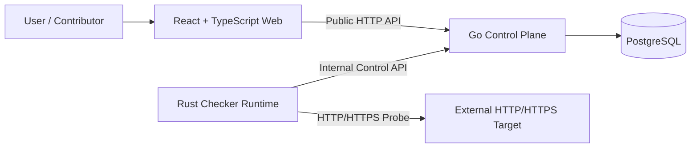
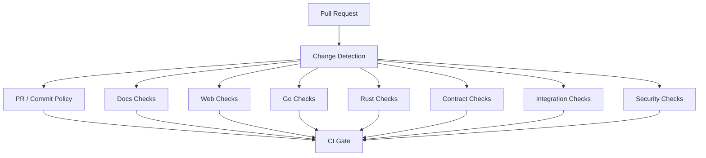

# uptime-lab Foundation Design

**Status:** Review candidate  
**Date:** 2026-09-17  
**Repository:** `kefyusuf/uptime-lab`  
**Scope:** Repository governance, architecture, modularity, contracts, testing, CI/CD, security, observability, documentation, and local development foundation  
**Decision state:** Architecture direction approved in discussion; this written specification requires explicit review before implementation planning begins.

---

## 1. Purpose

`uptime-lab` is a learning-oriented but production-disciplined uptime monitoring application built with three primary technology domains:

- **React + TypeScript** for the web application,
- **Go** for the control-plane backend,
- **Rust** for the execution-plane checker runtime.

The project is intentionally small at the product level and deliberately strict at the engineering level. Its purpose is not to demonstrate how many frameworks or infrastructure products can be assembled. Its purpose is to demonstrate how a maintainable multi-language product can be designed so that:

1. each runtime has a clear responsibility,
2. module boundaries are explicit and mechanically enforceable where practical,
3. contracts are versioned and reviewable,
4. tests provide layered evidence rather than only line coverage,
5. CI/CD protects the main branch without becoming unnecessarily expensive,
6. local development is reproducible through Docker,
7. documentation explains not only each area independently but also the relationships between frontend, backend, checker, data, and operations,
8. future modules can be added without restructuring the entire repository.

The engineering standard should resemble a serious open-source or industry repository even while the initial feature set remains small.

---

## 2. Goals

The foundation MUST support the following goals.

### 2.1 Product goals

- Register HTTP/HTTPS monitoring targets.
- Execute checks asynchronously through the Rust checker runtime.
- Persist monitor configuration and check results through the Go control plane.
- Present monitor state and history through the React application.
- Allow additional monitoring capabilities to be added later without replacing the core architecture.

### 2.2 Engineering goals

- Maintain a **single repository** with explicit runtime boundaries.
- Use a **modular monolith** for the Go control plane.
- Use **Ports and Adapters** for the Rust checker runtime.
- Use **feature/domain-oriented frontend organization** instead of copying backend layering into React.
- Treat OpenAPI contracts as first-class artifacts.
- Keep module data ownership explicit.
- Use domain events inside the Go process when they improve decoupling.
- Avoid a message broker until a concrete cross-process delivery requirement justifies one.
- Keep `main` releasable.
- Make CI path-aware and cost-conscious.
- Keep local development Docker-first.
- Make architectural rules testable rather than relying only on documentation.
- Use English for repository documentation, code comments intended for contributors, ADRs, PR templates, and public developer-facing text.

### 2.3 Quality goals

The repository should optimize for:

- maintainability,
- modularity,
- evolvability,
- testability,
- operational clarity,
- security by default,
- reproducible development,
- reviewability,
- deterministic builds where practical,
- minimal accidental coupling.

---

## 3. Non-goals

The foundation MUST NOT prematurely introduce the following:

- microservices,
- Kubernetes,
- Kafka, RabbitMQ, NATS, Redis Streams, or another broker,
- event sourcing,
- CQRS as a repository-wide pattern,
- generic repository abstractions,
- a global shared business-logic package,
- multi-tenancy,
- billing,
- authentication and authorization,
- service mesh infrastructure,
- distributed tracing backend infrastructure,
- multiple deployment environments before a deployment target is selected,
- separate versioning for each runtime,
- a plugin marketplace,
- arbitrary user-defined code execution.

These capabilities may be introduced later only when a concrete requirement justifies the cost.

---

## 4. Architectural principles

The following principles are normative.

### P-001 — Boundaries before abstractions

Code should be separated according to ownership and responsibility before generic abstractions are introduced. A duplicated three-line mapping is preferable to an abstraction that couples unrelated modules.

### P-002 — Dependency direction must be explicit

Business/domain logic must not depend on HTTP frameworks, database drivers, React components, Docker, environment variables, or vendor SDKs.

### P-003 — One owner per source of truth

A module owns its domain data and exposes behavior through application interfaces, contracts, or events. Other modules must not query that module's tables directly.

### P-004 — Contracts cross runtime boundaries

TypeScript, Go, and Rust must not share implementation code. Cross-runtime communication is defined through explicit contracts.

### P-005 — Architecture is idiomatic per runtime

Clean Architecture, DDD, and Ports and Adapters are tools, not branding requirements. They are applied where they improve the specific runtime:

- Go: pragmatic DDD plus modular Clean/Hexagonal boundaries.
- Rust: Ports and Adapters around the checker core.
- React: feature/domain-oriented modularity with enforced import direction.

### P-006 — Start synchronous and in-process unless distribution is required

Domain events can be dispatched in-process. Integration events, outbox processing, and brokers are introduced only when communication must become reliable across process boundaries.

### P-007 — Keep infrastructure replaceable, not invisible

Infrastructure details belong in adapters. The project should avoid pretending infrastructure does not exist; operational behavior must remain observable and documented.

### P-008 — Tests provide evidence at the cheapest appropriate layer

Domain rules belong primarily in unit tests, adapters in integration tests, contracts in contract tests, and critical product journeys in E2E tests.

### P-009 — Documentation is part of the architecture

A change that modifies architecture, contracts, persistence semantics, security assumptions, or operational behavior is incomplete without corresponding documentation.

### P-010 — Security is a product constraint

Because the checker performs network requests to user-provided targets, SSRF, DNS rebinding, redirect validation, resource exhaustion, and egress controls are architectural concerns rather than later hardening tasks.

---

## 5. System context



### Runtime ownership

| Runtime | Primary responsibility | Must not own |
|---|---|---|
| React/TypeScript | UI composition, client interaction, presentation state, API consumption | persistence, checker execution, backend business rules |
| Go API | domain rules, use cases, persistence ownership, public/internal contracts, scheduling/coordination | direct network probing implementation |
| Rust checker | concurrent probe execution, protocol handling, timeouts, retries, execution safeguards | primary business persistence, browser-facing product API |
| PostgreSQL | durable state owned by Go modules | cross-module business logic |
| Docker Compose | reproducible local runtime topology | product semantics |

---

## 6. Repository topology

The target repository shape is:

```text
uptime-lab/
├── .github/
│   ├── ISSUE_TEMPLATE/
│   ├── workflows/
│   ├── CODEOWNERS
│   ├── dependabot.yml
│   └── PULL_REQUEST_TEMPLATE.md
├── apps/
│   ├── web/
│   ├── api/
│   └── checker/
├── contracts/
│   └── openapi/
│       ├── public.yaml
│       └── internal.yaml
├── deploy/
│   └── docker/
├── docs/
│   ├── README.md
│   ├── glossary.md
│   ├── architecture/
│   ├── frontend/
│   ├── backend/
│   ├── checker/
│   ├── devops/
│   ├── testing/
│   ├── operations/
│   ├── security/
│   ├── adr/
│   └── superpowers/
│       └── specs/
├── scripts/
├── compose.yaml
├── .editorconfig
├── .gitignore
├── CONTRIBUTING.md
├── SECURITY.md
├── LICENSE
└── README.md
```

### Repository rules

- `apps/*` contains deployable/runtime code.
- `contracts/*` contains cross-runtime interface definitions.
- `docs/*` contains contributor-facing architecture and operational documentation.
- `deploy/*` contains deployment/runtime packaging assets that are not application source.
- `scripts/*` contains narrowly scoped repository automation. It must not become a hidden application layer.
- A root-level `shared`, `common`, `utils`, or `helpers` business package is forbidden.
- Generated code must be clearly isolated and must never become a domain dependency.

---

## 7. Go control plane architecture

### 7.1 Architecture style

The Go control plane is a **modular monolith**. It is a single deployable process with independently owned business modules.

Initial business module:

- `monitoring`

Potential future modules, not created initially:

- `incidents`,
- `notifications`,
- `accounts`,
- `teams`,
- `statuspages`,
- `integrations`,
- `billing`.

The absence of these modules in v0 is intentional. Extensibility is achieved through boundaries, not empty folders.

### 7.2 Target Go structure

```text
apps/api/
├── cmd/
│   └── api/
│       └── main.go
├── internal/
│   ├── modules/
│   │   └── monitoring/
│   │       ├── domain/
│   │       ├── application/
│   │       ├── ports/
│   │       ├── adapters/
│   │       │   ├── http/
│   │       │   └── postgres/
│   │       └── module.go
│   └── platform/
│       ├── config/
│       ├── database/
│       ├── httpserver/
│       ├── observability/
│       └── events/
├── migrations/
├── go.mod
└── go.sum
```

### 7.3 Dependency rule

```text
adapters -> application -> domain
            ^
            |
           ports
```

Normative rules:

- Domain packages must not import adapters or platform packages.
- Application packages coordinate use cases and depend on domain concepts plus ports.
- Ports express required external capabilities.
- Adapters implement ports.
- `platform` provides technical infrastructure only; it must not contain business/domain policy.
- HTTP handlers perform transport mapping and validation but do not own business decisions.
- SQL implementation details remain inside persistence adapters.

### 7.4 Pragmatic DDD

DDD is used only where the domain benefits from explicit modeling.

Likely initial concepts:

- `Monitor`,
- `MonitorID`,
- `TargetURL`,
- `CheckPolicy`,
- `MonitorState`,
- `CheckResult`.

Potential domain events:

- `MonitorCreated`,
- `MonitorEnabled`,
- `MonitorDisabled`,
- `CheckCompleted`,
- `MonitorBecameUnavailable`,
- `MonitorRecovered`.

The following are not domain objects merely because DDD exists:

- HTTP DTOs,
- pagination structures,
- health responses,
- database rows,
- environment configuration,
- logging structures.

### 7.5 Forbidden Go patterns

- Generic `Repository[T]` abstractions across unrelated aggregates.
- Domain packages importing database or HTTP packages.
- Cross-module SQL reads.
- Business rules embedded in handlers.
- A shared domain model consumed by every module.
- `interface{}`/`any`-driven service locators.
- Framework-style dependency containers when explicit constructors are sufficient.

---

## 8. Rust checker architecture

### 8.1 Architecture style

The Rust checker is an execution runtime designed around **Ports and Adapters**. Its primary concerns are concurrency, protocol correctness, resource control, network safety, and deterministic result reporting.

DDD is not imposed on the checker unless a future execution-domain problem requires it.

### 8.2 Cargo workspace

Target structure:

```text
apps/checker/
├── Cargo.toml
├── Cargo.lock
└── crates/
    ├── checker-core/
    ├── probe-http/
    ├── control-plane-client/
    └── checker/
```

Responsibilities:

#### `checker-core`

- probe abstractions,
- target and result types,
- execution policy,
- timeout/retry policy representation,
- orchestration that does not depend on HTTP client implementation.

#### `probe-http`

- HTTP/HTTPS probing implementation,
- redirect handling,
- DNS/IP safety validation,
- latency/status collection,
- response-size protection,
- TLS-related probe data when introduced.

#### `control-plane-client`

- typed adapter for the Go internal API,
- work acquisition,
- result submission,
- transport-level retries according to internal API policy.

#### `checker`

- binary entry point,
- configuration,
- dependency wiring,
- runtime startup/shutdown,
- structured logging and health lifecycle.

### 8.3 Extension model

A probe boundary should support future implementations such as:

- HTTP,
- TCP,
- DNS,
- TLS,
- ICMP where platform permissions allow it.

Future probe support must not require rewriting the worker runtime.

### 8.4 Forbidden Rust patterns

- Direct PostgreSQL access from checker crates.
- `reqwest` or another HTTP implementation leaking into `checker-core` interfaces.
- Global mutable state for runtime coordination.
- Business decisions copied from the Go domain layer.
- Unbounded concurrency.
- Unbounded response-body buffering.
- Retry loops without explicit budgets/backoff policy.

---

## 9. Frontend architecture

### 9.1 Architecture style

The frontend uses a **feature/domain-oriented** architecture inspired by feature-sliced boundaries without requiring dogmatic adherence to a framework-specific methodology.

Target structure:

```text
apps/web/src/
├── app/
│   ├── providers/
│   ├── router/
│   └── styles/
├── pages/
├── widgets/
├── features/
├── entities/
└── shared/
    ├── api/
    ├── config/
    ├── lib/
    └── ui/
```

### 9.2 Dependency direction

Higher-level presentation/composition layers may depend on lower-level reusable layers:

```text
app -> pages -> widgets -> features -> entities -> shared
```

Not every feature must pass through every layer.

Normative constraints:

- `shared` must not depend on business features.
- `entities` must not depend on pages or widgets.
- features must not import page-level components.
- backend domain logic must not be duplicated in React components.
- server state and client-only UI state must remain conceptually separate.
- generated API types/clients must remain in adapter-facing code, not leak into presentation/domain concepts without mapping when semantics differ.

### 9.3 Initial frontend scope

The initial frontend needs only the structure necessary for the first vertical slice:

- monitor entity representation,
- create-monitor feature,
- monitor-list widget/page,
- result/status presentation,
- API adapter.

No empty module shells should be created for hypothetical future features.

---

## 10. API and contract strategy

### 10.1 Contract types

Two contracts are maintained:

```text
contracts/openapi/public.yaml
contracts/openapi/internal.yaml
```

#### Public API

Used by the browser/frontend and future external consumers.

#### Internal API

Used by the Rust checker to communicate with the Go control plane.

### 10.2 Contract ownership

The Go control plane owns API semantics, while the OpenAPI documents are the reviewable contract source of truth.

Rules:

- Runtime implementations must conform to the contract.
- Generated clients are implementation details and must remain outside domain cores.
- Contract changes require dedicated CI validation.
- Breaking public API changes require explicit documentation and an ADR when they affect compatibility guarantees.
- Internal API changes must update Go and Rust contract tests in the same change.

### 10.3 Versioning

The initial APIs do not require URL-level version proliferation before the first stable compatibility commitment. Public versioning strategy must be documented before declaring a stable public API.

---

## 11. Data ownership and persistence

### 11.1 Database ownership

The Go control plane is the only runtime allowed to own durable application state in PostgreSQL.

Rust must communicate through the internal API.

### 11.2 Module ownership

Each Go business module owns its persistence schema/tables.

Preferred database organization:

```text
monitoring.monitors
monitoring.check_runs
monitoring.monitor_states
```

Future modules may own separate PostgreSQL schemas where useful.

### 11.3 Cross-module access

Direct cross-module SQL is forbidden.

A module may interact with another module through:

1. an application-level interface, or
2. a domain/integration event where asynchronous decoupling is justified.

### 11.4 Migrations

- Migrations are reviewed source code.
- Each migration must have a clear owner/module.
- CI must verify migrations against an ephemeral PostgreSQL instance.
- Destructive or non-backward-compatible migrations require an explicit rollout plan before production deployment exists.

---

## 12. Event model

### 12.1 Domain events

In-process domain events are allowed to decouple business reactions inside the Go control plane.

Example:

```text
CheckCompleted
      |
      +--> monitor state transition
      +--> incident policy (future)
      +--> notification policy (future)
```

### 12.2 Integration events

Integration events are introduced only when an event must cross a process boundary reliably.

The future progression is:

```text
Domain Event
   -> Integration Event
   -> Transactional Outbox
   -> Broker
   -> Consumer
```

This progression is NOT part of the initial implementation.

### 12.3 Event rules

- Events must represent completed facts, not commands disguised as events.
- Event names use past tense.
- Event payloads must not expose internal database structures accidentally.
- Event handlers must make idempotency explicit once delivery can be repeated.

---

## 13. Checker coordination

The first version supports a single checker instance.

Initial coordination may use an internal API flow such as:

```text
checker -> request due work
checker -> execute bounded concurrent probes
checker -> submit results
```

Multi-worker distribution, leasing, distributed locks, or broker-based work queues are deferred.

The internal API must not make future multi-worker support impossible, but the first implementation must not invent distributed coordination before it is needed.

---

## 14. Security architecture

Security is a foundation requirement because the application initiates outbound requests to user-provided targets.

### 14.1 SSRF protection

The checker MUST eventually enforce at least the following before public network exposure:

- only supported schemes (`http`, `https`) are accepted,
- credentials embedded in URLs are rejected,
- loopback addresses are rejected,
- private address ranges are rejected unless a future explicitly isolated private-monitoring mode is designed,
- link-local and reserved ranges are rejected,
- cloud metadata endpoints are not reachable,
- DNS resolution results are validated before connection,
- redirect destinations are revalidated,
- redirect count is bounded,
- DNS rebinding risk is considered at connection time,
- target ports follow an explicit policy,
- response body processing is size-bounded,
- request duration is bounded,
- concurrent work is bounded.

### 14.2 Process isolation

Production deployment should place the checker in a more restricted execution/egress boundary than the control plane where practical.

### 14.3 Secrets

- Secrets must never be committed.
- `.env.example` contains names and safe development defaults only.
- Logs must redact credentials, tokens, and sensitive URL components.
- GitHub Actions use least-privilege permissions.

### 14.4 Public exposure

Authentication/authorization is out of initial scope. Therefore an unauthenticated initial build must not be presented as production-ready for arbitrary internet exposure.

---

## 15. Observability

Observability starts with conventions rather than a large monitoring stack.

### 15.1 Required foundations

- structured logs,
- stable log fields,
- request/correlation IDs,
- propagation of correlation context between Go and Rust,
- health/readiness semantics,
- explicit startup/shutdown logging,
- bounded-cardinality metric naming conventions,
- OpenTelemetry-compatible instrumentation design.

### 15.2 Deferred infrastructure

The following are not required for initial local development:

- Prometheus,
- Grafana,
- Loki,
- Tempo,
- an OpenTelemetry Collector.

They may be added after instrumentation produces useful signals.

---

## 16. Local development model

### 16.1 Docker-first rule

Local development is orchestrated through Docker Compose from the beginning.

Required local platform:

- Docker Engine / Docker Desktop,
- Docker Compose v2.

Language runtimes should not be mandatory on the host for the canonical development path.

### 16.2 Initial services

```text
web
api
checker
db
```

### 16.3 Development behavior

- Use Compose Watch or equivalent Docker-native synchronization for rapid feedback.
- Dependency/build caches should use named volumes where practical.
- Service startup must use health checks rather than fixed sleeps.
- Browser-to-API local routing should avoid unnecessary CORS complexity, for example through the frontend dev server proxy.
- Containers should use deterministic dependency lock files.

### 16.4 Test runtime

Integration tests must prefer ephemeral real dependencies for critical adapters, especially PostgreSQL, rather than mocks pretending to be databases.

Network-probe tests must use controlled local HTTP test servers and must not depend on external internet availability.

---

## 17. Git strategy

### 17.1 Long-lived branches

Only `main` is long-lived.

The repository does not use GitFlow and does not maintain a permanent `develop` branch.

### 17.2 Short-lived branches

Examples:

```text
feat/12-create-monitor
fix/31-checker-timeout
refactor/44-monitor-domain
test/52-probe-retry
docs/18-architecture
ci/23-path-aware-checks
chore/repository-bootstrap
```

Issue numbers are preferred once issue-driven development starts.

### 17.3 Bootstrap exception

Because the repository was empty and had no Git ref, this specification is allowed to become the initial root commit on `main`.

This is the only planned direct-to-main bootstrap exception.

After the baseline exists, all implementation changes must use short-lived branches and pull requests.

### 17.4 Commit convention

Conventional Commits are required.

Format:

```text
<type>(<scope>): <description>
```

Primary types:

- `feat`,
- `fix`,
- `refactor`,
- `test`,
- `docs`,
- `ci`,
- `build`,
- `chore`,
- `perf`,
- `revert`.

Primary scopes:

- `web`,
- `api`,
- `checker`,
- `contracts`,
- `devops`,
- `architecture`,
- `docs`.

Examples:

```text
feat(api): add monitor registration use case
fix(checker): enforce probe timeout
ci(checker): add clippy verification
docs(architecture): document module boundaries
```

### 17.5 Merge model

Target repository rules:

- direct pushes to `main`: blocked after bootstrap,
- force pushes: blocked,
- branch deletion for `main`: blocked,
- merge commits: disabled,
- rebase merge: disabled,
- squash merge: enabled,
- linear history: required,
- pull request required,
- required status checks enabled,
- conversations must be resolved before merge.

A required external approval is not enabled while there is only one active maintainer because it would make the repository operationally unmergeable. Once an additional maintainer exists, review requirements can be strengthened.

### 17.6 Pull request titles

PR titles follow Conventional Commit semantics so squash commits produce a clean `main` history.

Example:

```text
feat(api): add monitor registration
```

---

## 18. Pull request standard

Every substantive PR should explain:

```text
## Summary
## Why
## Scope
## Architecture impact
## Contract impact
## Database impact
## Security impact
## Testing evidence
## Documentation
## Breaking changes
## Checklist
```

Sections that do not apply should explicitly say `None` rather than being silently omitted.

### Definition of Done

A change is not done merely because code compiles.

Where applicable, a PR must include:

- implementation,
- automated tests,
- contract updates,
- migration updates,
- architecture checks,
- security considerations,
- observability changes,
- documentation changes,
- CI evidence.

---

## 19. CI architecture

### 19.1 Objectives

CI must be:

- fast enough for daily development,
- strict enough to protect `main`,
- path-aware,
- reproducible,
- observable when it fails,
- cheap enough not to rerun unrelated stacks unnecessarily.

### 19.2 Conceptual pipeline



### 19.3 Stable required gate

Branch protection should require one stable aggregate job such as:

```text
ci / gate
```

The gate verifies that every required job for the detected change set either:

- succeeded, or
- was legitimately skipped because the path was unaffected.

This avoids brittle branch protection configuration based on a large set of dynamically skipped jobs.

### 19.4 Path-aware execution

Examples:

- docs-only change: documentation checks only,
- checker-only change: Rust checks plus affected contracts/integration,
- public OpenAPI change: contract + Go + frontend + integration,
- internal OpenAPI change: contract + Go + Rust + integration,
- compose/deployment change: integration and container checks.

### 19.5 CI concurrency

Superseded PR runs should be cancelled where safe so obsolete commits do not consume CI capacity.

### 19.6 GitHub Actions security

- Workflow permissions default to read-only.
- Write permissions are granted only to jobs that require them.
- Third-party actions are pinned to immutable full commit SHAs where practical.
- Secrets are not exposed to untrusted fork execution contexts.
- Shell scripts use strict failure handling.

---

## 20. Test strategy

The project follows a layered evidence model rather than one global test category.

### 20.1 Test levels

```text
Static analysis
      ↓
Unit tests
      ↓
Architecture tests
      ↓
Adapter integration tests
      ↓
Contract tests
      ↓
Cross-runtime integration tests
      ↓
Critical E2E journeys
```

### 20.2 Frontend

Expected tools/capabilities:

- TypeScript strict type checking,
- ESLint-based correctness/boundary checks,
- unit tests,
- React component/integration tests,
- Playwright for critical E2E journeys.

Critical E2E coverage should be small and meaningful rather than duplicating every unit test through a browser.

### 20.3 Go

Expected checks:

- formatting,
- `go vet`,
- static analysis/linting,
- unit tests,
- repository/PostgreSQL integration tests,
- API integration tests,
- architecture/dependency checks,
- race detection for appropriate suites,
- fuzz tests for parsers/validators where useful.

### 20.4 Rust

Expected checks:

- `cargo fmt --check`,
- `cargo check`,
- `cargo clippy`,
- `cargo test`,
- crate-level architecture checks,
- probe adapter integration tests,
- internal API contract tests.

### 20.5 Contract tests

Contract validation verifies:

- OpenAPI syntax,
- breaking-change policy when compatibility is declared,
- Go implementation compatibility,
- generated/typed frontend client compatibility,
- Rust internal client compatibility.

### 20.6 Integration tests

At least one cross-runtime test must eventually prove:

```text
create monitor
  -> Go persists monitor
  -> Rust obtains work
  -> Rust probes controlled target
  -> Rust submits result
  -> Go persists result
  -> public API exposes result
```

### 20.7 Coverage policy

No arbitrary global coverage percentage is imposed before meaningful production code exists.

The intended policy is a **coverage ratchet**:

1. collect coverage once the first vertical slice exists,
2. establish a realistic baseline,
3. prevent unexplained regression in critical modules,
4. focus hard requirements on domain/application behavior rather than generated/adaptor boilerplate.

Coverage is evidence, not the definition of correctness.

---

## 21. Architecture fitness functions

Important boundaries should be mechanically checked.

Examples:

### Go

- domain packages cannot import adapters/platform implementation packages,
- one business module cannot import another module's persistence adapter,
- forbidden package dependencies fail CI.

### Frontend

- layer import direction is linted,
- page/widget code cannot be imported by lower layers,
- generated API code remains inside approved adapter paths.

### Rust

- `checker-core` cannot depend on `reqwest`, control-plane implementation, or binary crate,
- probe crates depend inward on core abstractions,
- dependency graph violations fail CI.

These checks are treated as architectural tests rather than style preferences.

---

## 22. CI tiers

### Pull request tier

Fast feedback:

- formatting,
- lint/static checks,
- unit tests,
- affected architecture tests,
- affected contract checks,
- affected integration tests.

### Main tier

Includes PR guarantees plus:

- container build,
- Docker Compose integration smoke,
- critical E2E flow where stable.

### Scheduled tier

Can include slower work:

- deeper security scanning,
- dependency audits,
- fuzzing budgets,
- extended test suites,
- stale dependency checks.

### Release tier

Includes:

- complete verification,
- production OCI image builds,
- image vulnerability scan,
- SBOM generation,
- artifact provenance/attestation where supported,
- release notes.

---

## 23. CD and release strategy

A concrete production hosting platform is intentionally not selected in this foundation.

Therefore initial CD is **artifact-first**, not environment-specific.

### 23.1 Initial release model

- One product version for the monorepo.
- Semantic Versioning after the first declared release.
- Conventional Commits provide release metadata.
- Release automation may create release PRs rather than publishing directly from arbitrary commits.
- Version tags build immutable release artifacts.

### 23.2 Container artifacts

Expected future production artifacts:

- Go API image,
- Rust checker image,
- frontend web image/static bundle image depending on deployment design.

Images must be tagged immutably by release version and commit SHA.

### 23.3 Environment deployment

Staging/production deployment workflows are deferred until the hosting target is chosen. The repository must not hard-code cloud assumptions prematurely.

---

## 24. Dependency management

- Language lock files are committed.
- Automated dependency update PRs are grouped conservatively by ecosystem.
- Major version updates require explicit review.
- Security updates can be prioritized independently.
- Automated dependency PRs must pass the same required CI gate as human-authored changes.

Potential ecosystems:

- npm,
- Go modules,
- Cargo,
- GitHub Actions,
- Docker base images.

---

## 25. Documentation architecture

Documentation is English-only for project-facing material.

Target structure:

```text
docs/
├── README.md
├── glossary.md
├── architecture/
│   ├── system-context.md
│   ├── container-view.md
│   ├── component-view.md
│   ├── module-boundaries.md
│   ├── dependency-rules.md
│   ├── data-ownership.md
│   ├── event-model.md
│   ├── api-contracts.md
│   ├── runtime-flows.md
│   └── change-flow.md
├── frontend/
│   ├── architecture.md
│   ├── module-boundaries.md
│   ├── state-management.md
│   ├── api-integration.md
│   └── testing.md
├── backend/
│   ├── architecture.md
│   ├── modular-monolith.md
│   ├── domain-model.md
│   ├── application-layer.md
│   ├── persistence.md
│   ├── events.md
│   └── testing.md
├── checker/
│   ├── architecture.md
│   ├── execution-model.md
│   ├── concurrency.md
│   ├── probes.md
│   ├── control-plane-contract.md
│   └── testing.md
├── devops/
│   ├── local-development.md
│   ├── docker.md
│   ├── ci-cd.md
│   ├── environments.md
│   └── releases.md
├── testing/
│   ├── strategy.md
│   ├── test-levels.md
│   ├── contract-testing.md
│   └── e2e.md
├── security/
│   ├── threat-model.md
│   ├── ssrf.md
│   ├── dependency-security.md
│   └── ci-security.md
├── operations/
│   ├── observability.md
│   ├── health-checks.md
│   └── troubleshooting.md
└── adr/
    ├── README.md
    └── NNNN-*.md
```

Only documents needed by the current implementation phase should be created. The target structure describes ownership, not a requirement to create empty documents.

---

## 26. Cross-area documentation requirement

Frontend, backend, checker, and DevOps documentation must not become isolated silos.

The architecture documentation must explain end-to-end changes through the system.

Example feature change:

```text
Configure HTTP request timeout

Product requirement
    -> Go domain/application model
    -> persistence if required
    -> public/internal OpenAPI contracts
    -> React configuration UI
    -> Rust execution policy
    -> tests
    -> CI
    -> operational signals
```

`docs/architecture/change-flow.md` should eventually document these relationships using concrete examples.

Each area-specific architecture document should use a consistent outline where applicable:

1. Purpose
2. Responsibilities
3. Non-responsibilities
4. Architecture
5. Module boundaries
6. Dependencies
7. Contracts
8. Interaction with other areas
9. Data flow
10. Error handling
11. Observability
12. Testing
13. Security considerations
14. Extension points
15. Anti-patterns
16. Related ADRs

---

## 27. ADR policy

Architecture Decision Records are required for material decisions that are expensive to reverse or affect multiple boundaries.

Examples:

- architecture style,
- repository/branching model,
- API compatibility policy,
- persistence ownership changes,
- introducing a message broker,
- extracting a service,
- selecting a production deployment platform,
- adding authentication/identity architecture.

ADRs should not be created for ordinary implementation details.

An ADR records:

- context,
- decision,
- alternatives considered,
- consequences,
- status.

---

## 28. Error handling principles

### Go

- Domain errors express business meaning.
- Application errors preserve semantic context.
- HTTP adapters map errors to stable API responses.
- Internal errors are logged with correlation IDs without leaking sensitive details to clients.

### Rust

- Probe errors are categorized rather than flattened into opaque strings.
- Timeout, DNS, connection, TLS, HTTP status, policy rejection, and internal failures remain distinguishable when operationally useful.
- Retryability is explicit.

### Frontend

- User-visible errors are mapped from API semantics, not raw server stack errors.
- Retryable server-state failures and validation failures are treated differently.

---

## 29. Performance and scalability principles

The initial architecture should scale vertically and through bounded concurrency before distribution is introduced.

### Go

- Keep request handlers stateless except for explicitly owned process services.
- Database access must be bounded and observable.
- Avoid N+1 query patterns.

### Rust

- Use bounded concurrency.
- Use explicit timeout budgets.
- Avoid loading full response bodies unless needed.
- Apply connection reuse where safe.

### PostgreSQL

- Indexes must correspond to measured query requirements.
- Schema changes should be observable through query plans when performance becomes relevant.

### Frontend

- Avoid unnecessary global state.
- Keep server state cache behavior explicit.
- Measure before introducing aggressive optimization.

---

## 30. Initial vertical slice

The first real product slice after repository/bootstrap work is:

```text
1. User opens web application
2. User enters an HTTP/HTTPS target
3. Web calls public Go API
4. Go validates and persists Monitor
5. Rust checker requests due work from internal API
6. Rust checker safely probes controlled target
7. Rust submits CheckResult
8. Go persists result and updates monitor state
9. Web fetches and displays current result
```

This slice exercises every runtime boundary and therefore becomes the primary architectural validation case.

---

## 31. Implementation sequence

Implementation should proceed through small reviewable PRs.

Proposed sequence:

### PR 1 — Repository engineering baseline

- root repository files,
- GitHub templates,
- branch/commit policy tooling,
- documentation entry points,
- minimal CI policy validation.

### PR 2 — Architecture documentation baseline

- system context,
- module boundaries,
- runtime relationships,
- ADR baseline.

### PR 3 — Docker development environment

- Compose topology,
- service placeholders sufficient for health verification,
- development watch behavior,
- PostgreSQL health.

### PR 4 — Go monitoring foundation

- Go module,
- monitoring module skeleton,
- platform composition,
- health endpoint,
- unit/architecture checks.

### PR 5 — Rust checker foundation

- Cargo workspace,
- checker core,
- HTTP probe adapter boundary,
- control-plane client boundary,
- Rust CI checks.

### PR 6 — Frontend foundation

- React/TypeScript application,
- feature/domain boundaries,
- lint architecture rules,
- frontend CI checks.

### PR 7 — First vertical slice

- contracts,
- monitor creation,
- persistence,
- checker execution,
- result submission,
- frontend display,
- cross-runtime integration test,
- critical E2E coverage.

This order may be refined in the implementation plan, but implementation must remain incremental and PR-sized.

---

## 32. Explicit anti-patterns

The project prohibits the following unless a later ADR explicitly changes the rule:

- generic repository abstractions without concrete need,
- global business `shared/common/utils` packages,
- hidden cross-module database access,
- circular module dependencies,
- business logic in HTTP handlers,
- business logic in React components,
- business logic in Rust transport adapters,
- direct frontend-to-database communication,
- direct Rust-to-database communication,
- duplicated hand-maintained contract models without validation,
- event sourcing without a domain requirement,
- a message broker without a delivery requirement,
- extracting services before a measurable need,
- framework-specific types in domain packages,
- unbounded async concurrency,
- network requests without SSRF controls and timeout budgets,
- CI workflows with broad write permissions by default,
- documentation that describes one area without its integration boundaries where those boundaries are relevant.

---

## 33. Acceptance criteria for the foundation

The foundation phase is complete only when all of the following are true:

### Repository governance

- `main` has protected merge semantics after bootstrap.
- short-lived branches and PRs are the normal workflow.
- Conventional Commit policy is documented and checked.
- squash merge is the canonical merge strategy.

### Architecture

- Go module boundaries are explicit.
- Rust crate boundaries are explicit.
- frontend import boundaries are explicit.
- cross-runtime contracts are explicit.
- direct checker database access is prohibited.
- cross-module database access is prohibited.

### Local development

- one documented Docker-first workflow starts the stack.
- local service readiness is health-based.
- a contributor does not need host-installed Go/Rust/Node for the canonical path.

### Testing

- each runtime has static checks and tests.
- architecture boundaries have mechanical checks.
- contracts have validation.
- the first vertical slice eventually has a cross-runtime integration test.

### CI/CD

- CI is path-aware.
- a stable aggregate required gate protects `main`.
- workflow permissions follow least privilege.
- release artifacts can be produced independently of a specific production host.

### Documentation

- documentation is English.
- architecture relationships are documented end-to-end.
- frontend/backend/checker/devops areas have clear ownership.
- material architectural changes use ADRs.

### Security

- SSRF is recognized as a first-class threat.
- probe concurrency, time, redirects, and response processing are bounded.
- secrets/logging rules are documented.

---

## 34. Decisions locked by this specification

The following decisions are considered part of the foundation once this written specification is approved:

- **FD-001:** Monorepo repository model.
- **FD-002:** `main` plus short-lived branches; no permanent `develop` branch.
- **FD-003:** PR-first workflow after the empty-repository bootstrap commit.
- **FD-004:** Conventional Commits and squash merge.
- **FD-005:** Go control plane is a modular monolith.
- **FD-006:** Go modules use pragmatic DDD plus Clean/Hexagonal boundaries.
- **FD-007:** Rust checker uses Ports and Adapters in a Cargo workspace.
- **FD-008:** Frontend uses feature/domain-oriented modular boundaries.
- **FD-009:** PostgreSQL durable state is owned by the Go control plane.
- **FD-010:** Rust does not access PostgreSQL directly.
- **FD-011:** Cross-runtime communication is contract-driven.
- **FD-012:** Public and internal OpenAPI contracts are separated.
- **FD-013:** Domain events may be in-process; no broker initially.
- **FD-014:** Docker Compose is the canonical local development environment.
- **FD-015:** CI is path-aware and terminates in a stable required gate.
- **FD-016:** Tests follow layered evidence rather than one global category.
- **FD-017:** Architecture boundaries should have automated fitness checks.
- **FD-018:** Release automation is artifact-first until a deployment target is selected.
- **FD-019:** Documentation is English and includes cross-area relationships.
- **FD-020:** SSRF and bounded network execution are foundation security requirements.

---

## 35. Deferred decisions

The following decisions are intentionally deferred because choosing them now would create unnecessary commitment:

- production hosting platform,
- cloud provider,
- Kubernetes/container orchestration,
- authentication provider,
- multi-tenancy model,
- broker technology,
- distributed work-leasing strategy,
- public API long-term compatibility/versioning policy,
- observability backend vendor/stack,
- notification providers,
- billing provider,
- private-network monitoring architecture.

Each deferred decision must be revisited through an ADR when its triggering requirement becomes real.

---

## 36. Review checklist

Before implementation planning, reviewers should verify:

- [ ] Runtime responsibilities are unambiguous.
- [ ] Go, Rust, and frontend architecture styles fit their actual responsibilities.
- [ ] No unnecessary distributed-system component is introduced.
- [ ] Module ownership and data ownership are explicit.
- [ ] CI strategy can support a small repository without wasteful full-matrix execution on every change.
- [ ] Test strategy separates unit, adapter, contract, integration, and E2E evidence.
- [ ] Docker-first development remains practical on Windows/WSL2, macOS, and Linux hosts running Docker Compose.
- [ ] Documentation relationships between frontend, backend, checker, DevOps, data, and security are explicit.
- [ ] SSRF/network safety is treated as an architectural constraint.
- [ ] The first vertical slice is small enough to validate the architecture without introducing future modules prematurely.

---

## 37. Next gate

After this specification is reviewed and explicitly approved:

1. create a detailed implementation plan,
2. break foundation work into reviewable tasks/PRs,
3. begin with repository engineering baseline only,
4. verify each stage before proceeding to the next.

No application implementation should begin before the implementation plan is approved.
